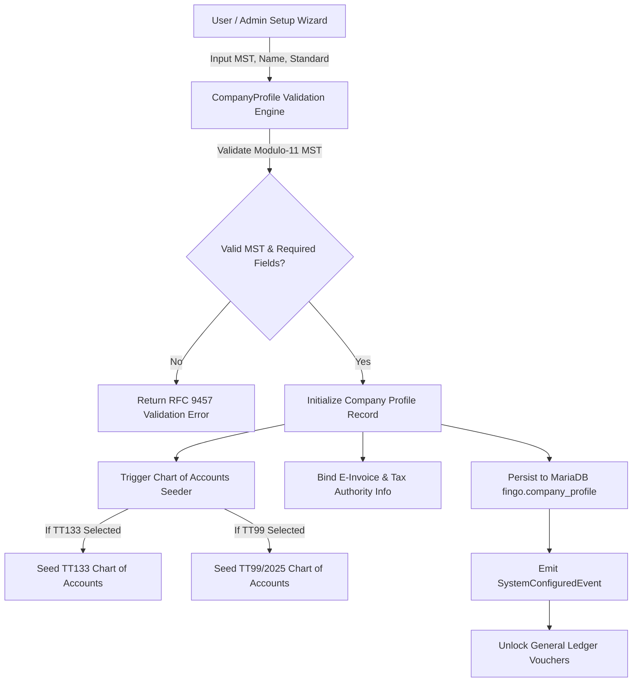

# Business Requirements Document (BRD) & Enterprise Specification
## Module: `CompanyProfile` (Hồ sơ Doanh nghiệp & Thiết lập Pháp nhân Thuế)

**Author**: Senior Solution Architect & Chief Accountant (VAS/Circular 99/Circular 133 Lead)  
**Document Code**: BRD-FIN-SYS-001  
**Status**: APPROVED / PRODUCTION-READY SPECIFICATION  
**Target Application**: FinGo (SME Accounting Desktop)  

---

# 1. Production Readiness Audit: Current `CompanyProfile` vs. Reality

### Executive Verdict: **CANNOT OPERATE IN PRODUCTION (FAIL)**

The existing struct in `fingo/internal/domain/system/system.go`:
```go
type CompanyProfile struct {
    ID                   string
    CompanyName          string
    TaxCode              string
    Address              string
    LegalRepresentative  string
    ChiefAccountant      string
    CurrencyCode         string
    FiscalYearStartMonth time.Month
    AccountingStandard   string // TT133 or TT200
}
```

### Critical Gaps (Why it Fails in Production):

1. **Tax Registration & Jurisdiction Failure (Luật Quản lý thuế 2019, TT 105/2020 & TT 86/2024)**:
   - Missing **Supervisory Tax Authority (Cơ quan thuế quản lý trực tiếp)** (Code & Name, e.g. `Cục Thuế TP Hà Nội`, `Chi cục Thuế Khu vực...`). Without this, automated VAT/CIT/PIT XML submissions cannot be routed or validated.
   - Missing **Tax Authority Code (Mã CQT)**.
2. **Electronic Invoicing Compliance (Decree 123/2020/ND-CP, Decree 70/2025/ND-CP & Circular 32/2025/TT-BTC)**:
   - Missing **E-Invoice Integration Credentials**: Provider Type (MISA MeInvoice, VNPT, Viettel, BKAV, TCT Direct), Tax transmission method, Digital Certificate Serial (`token_serial`), Subject DN, Certificate Expiration Date.
   - In Vietnam, an accounting desktop app without digital certificate binding cannot sign XML e-invoices.
3. **Banking & Statutory Tax Remittance (Circular 80/2021/TT-BTC)**:
   - Missing statutory payment bank account (Treasury account number, State Bank branch, State Budget chapter code - *Mã chương*, *Mã tiểu mục*).
4. **Regulatory Accounting Method Invariants (Circular 99/2025/TT-BTC & Circular 133/2016/TT-BTC)**:
   - Missing **Inventory Costing Method** (*Phương pháp tính giá xuất kho*): FIFO (`FIFO`), Moving Weighted Average (`MOVING_AVG`), Monthly Periodic Average (`MONTHLY_AVG`).
   - Missing **VAT Calculation Method** (*Phương pháp tính thuế GTGT*): Credit-invoice method (*Khấu trừ*) vs Direct method (*Trực tiếp*).
   - Missing **Depreciation Rules**: Circular 45/2013/TT-BTC standard straight-line.
5. **Multi-Tenancy & Data Security (Law 91/2025/QH15 - PDPL & Decree 53/2022)**:
   - Missing Encryption Key identifier, Data Residency declaration (stored in Vietnam), and Head Office vs Branch Indicator (Mã số thuế 10 số vs 13 số: `0101234567-001`).

---

# 2. Comprehensive Domain Specification: Production `CompanyProfile`

### 2.1 Complete Production Domain Model

```go
package system

import (
	"time"
)

type AccountingRegime string

const (
	RegimeCircular133 AccountingRegime = "TT133_2016" // SME Regime
	RegimeCircular99  AccountingRegime = "TT99_2025"  // Enterprise Regime (Replacing TT200)
)

type VATMethod string

const (
	VATMethodDeduction VATMethod = "DEDUCTION" // Khấu trừ (TK 133, 3331)
	VATMethodDirect    VATMethod = "DIRECT"    // Trực tiếp trên doanh thu
)

type CostingMethod string

const (
	CostingFIFO           CostingMethod = "FIFO"
	CostingMovingWeighted CostingMethod = "MOVING_WEIGHTED_AVG"
	CostingPeriodic       CostingMethod = "PERIODIC_AVG"
)

type BusinessType string

const (
	BusinessTrading    BusinessType = "TRADING"    // Thương mại
	BusinessService    BusinessType = "SERVICE"    // Dịch vụ
	BusinessProduction BusinessType = "PRODUCTION" // Sản xuất
	BusinessMix        BusinessType = "MIXED"      // Hỗn hợp
)

type TaxAuthority struct {
	Code      string `json:"code"`       // e.g. "10500"
	Name      string `json:"name"`       // e.g. "Chi cục Thuế Quận 1"
	CityCode  string `json:"city_code"`  // Mã tỉnh/thành phố
}

type BankAccountRegistration struct {
	AccountNumber string `json:"account_number"`
	BankName      string `json:"bank_name"`
	BankBranch    string `json:"bank_branch"`
	BankSwiftCode string `json:"bank_swift_code"`
	IsTaxPayment  bool   `json:"is_tax_payment"` // Dùng để nộp thuế điện tử
}

type EInvoiceConfig struct {
	ProviderCode     string    `json:"provider_code"` // MISA, VNPT, VIETTEL, TCT
	TaxServiceURL    string    `json:"tax_service_url"`
	CertSerial       string    `json:"cert_serial"`
	CertSubjectDN    string    `json:"cert_subject_dn"`
	CertValidTo      time.Time `json:"cert_valid_to"`
	AutoSendToTCT    bool      `json:"auto_send_to_tct"`
}

type ProductionCompanyProfile struct {
	ID                     string                  `json:"id"`
	TaxCode                string                  `json:"tax_code"` // MST 10 hoặc 13 chữ số
	LegalName              string                  `json:"legal_name"`
	TradeName              string                  `json:"trade_name"`
	EnglishName            string                  `json:"english_name"`
	Address                string                  `json:"address"`
	ProvinceCity           string                  `json:"province_city"`
	DistrictWard           string                  `json:"district_ward"`
	Phone                  string                  `json:"phone"`
	Email                  string                  `json:"email"`
	Website                string                  `json:"website"`
	LegalRepresentative    string                  `json:"legal_representative"`
	RepresentativePosition string                  `json:"representative_position"`
	ChiefAccountant        string                  `json:"chief_accountant"`
	TaxAgentName           string                  `json:"tax_agent_name,omitempty"`
	TaxAgentCode           string                  `json:"tax_agent_code,omitempty"`
	
	// Statutory Tax Jurisdiction
	TaxAuthority           TaxAuthority            `json:"tax_authority"`
	StateBudgetChapter     string                  `json:"state_budget_chapter"` // Mã chương (e.g. 754, 552)
	
	// Accounting & Regulatory Parameters
	Regime                 AccountingRegime        `json:"regime"`
	BaseCurrency           string                  `json:"base_currency"` // Standard: VND
	FiscalYearStartMonth   time.Month              `json:"fiscal_year_start_month"` // Standard: January
	VATMethod              VATMethod               `json:"vat_method"`
	CostingMethod          CostingMethod           `json:"costing_method"`
	BusinessType           BusinessType            `json:"business_type"`
	
	// Banking & Electronic Filing
	RegisteredBanks        []BankAccountRegistration `json:"registered_banks"`
	EInvoice               EInvoiceConfig          `json:"einvoice"`
	
	// Operational State
	IsActive               bool                    `json:"is_active"`
	LockDate               time.Time               `json:"lock_date"` // Ngày khóa sổ
	CreatedAt              time.Time               `json:"created_at"`
	UpdatedAt              time.Time               `json:"updated_at"`
}
```

---

# 3. Use Cases & Behavioral Flows

## UC-01: First-Time Setup (Khởi tạo Hồ sơ Doanh nghiệp)
* **Actor**: Administrator / Chief Accountant.
* **Preconditions**: Blank database, user logged in with `ADMIN` role.
* **Main Flow (Happy Path)**:
  1. System displays Setup Wizard step 1: Legal Identity.
  2. User enters `TaxCode` (e.g. `0101234567`).
  3. System triggers online lookup via General Department of Taxation (GDT) National Business API to auto-fill Legal Name, Address, and Supervisory Tax Authority.
  4. User reviews, confirms Legal Representative and Chief Accountant.
  5. User selects Accounting Standard: `Circular 99/2025/TT-BTC` (Enterprise) or `Circular 133/2016/TT-BTC` (SME).
  6. User picks Inventory Costing Method (`MOVING_WEIGHTED_AVG`) and VAT Method (`DEDUCTION`).
  7. User enters Tax Payment Bank Account and E-Invoice provider credentials.
  8. System validates TaxCode checksum, creates `CompanyProfile`, initializes default Chart of Accounts according to chosen circular, and initializes Fiscal Year 1.
* **Alternative Flow (A1 - Offline Setup without Internet)**:
  - Step 3 fails (network timeout). System prompts user to enter Legal Name, Address, and Tax Authority manually from Business Registration License (*Giấy ĐKKD*).
* **Exception Flow (E1 - Invalid Tax Code Checksum)**:
  - Step 2: Tax code fails mod-11 validation or contains non-numeric characters. System displays `ERR_INVALID_TAX_CODE: Mã số thuế không đúng cấu trúc quy định tại Thông tư 105/2020/TT-BTC`. Input blocked.
* **Exception Flow (E2 - Regime Modification After Transactions Exist)**:
  - User attempts to switch from `TT133` to `TT99` after vouchers exist. System blocks update: `ERR_REGIME_CHANGE_LOCKED: Không thể thay đổi chế độ kế toán sau khi đã phát sinh chứng từ`.

## UC-02: Digital Certificate & E-Invoice Registration
* **Actor**: Chief Accountant.
* **Preconditions**: CompanyProfile active. USB Token or Cloud HSM attached.
* **Main Flow**:
  1. User navigates to E-Invoice Configuration.
  2. System detects connected PKCS#11 token, extracts Certificate Serial, Subject DN (matching Company Legal Name and MST), and Valid-To timestamp.
  3. User confirms e-invoice series template (e.g. `1/001`, `C26TAV`).
  4. System executes test handshake with General Department of Taxation (TCT) gateway.
  5. System records configuration with status `ACTIVE`.

---

# 4. System Business Rules (Invariants)

| Rule ID | Name | Formal Invariant Specification |
| :--- | :--- | :--- |
| **BR-CP-01** | Tax Code Validation | Tax code MUST be exactly 10 digits (Enterprise) or 13 digits with hyphen (Branch: `XXXXXXXXXX-YYY`). First 10 digits must pass the weighted modulo-11 checksum formula per Decree 01/2021/ND-CP. |
| **BR-CP-02** | Base Currency Immutability | `BaseCurrency` MUST default to `VND`. Changing base currency to a foreign currency requires formal approval of Ministry of Finance and can only occur at the start of a fiscal year with zero unposted vouchers. |
| **BR-CP-03** | Costing Method Consistency | The Inventory Costing Method (FIFO, Moving Average) MUST remain consistent throughout an entire fiscal year per Circular 99 / Circular 200 (Principle of Consistency - *Nguyên tắc nhất quán*). Changes can only be enacted on Jan 1 of a new fiscal year. |
| **BR-CP-04** | Head Office Tax Remittance Rule | Dependent branches (*Chi nhánh phụ thuộc*) must record head office tax code in parent mapping for consolidated VAT return filing pursuant to Circular 80/2021/TT-BTC. |
| **BR-CP-05** | Digital Certificate Expiry Warning | System MUST issue a daily `WARN` alert in UI if USB Token / Digital Certificate has $\le 30$ days remaining before expiration to prevent interrupted e-invoice issuance. |

---

# 5. Data Flow Diagram (Mermaid)



---

# 6. Obsidian Mind Map Wrap-up

```text
# [[CompanyProfile]]
- **Legal Identity**
  - [[TaxCode]] (10-digit / 13-digit, Modulo-11 verified)
  - [[LegalName]] & [[TradeName]] (UTF-8 tiếng Việt)
  - [[TaxAuthority]] (Mã Cơ quan thuế quản lý trực tiếp)
  - [[StateBudgetChapter]] (Mã Chương - 754/552)
- **Accounting & Compliance Spine**
  - [[AccountingRegime]] (Circular 99/2025 vs Circular 133/2016)
  - [[BaseCurrency]] (VND, Rounding Banker)
  - [[VATMethod]] (Deduction vs Direct)
  - [[CostingMethod]] (FIFO, Moving Weighted Average)
  - [[FiscalYear]] (Calendar Jan-Dec, Lock Date)
- **External Interfaces**
  - [[EInvoiceProvider]] (Decree 123/2020 & Circular 32/2025/TT-BTC)
  - [[TaxPaymentBank]] (Circular 80/2021 State Treasury accounts)
  - [[DigitalCertificate]] (PKCS#11 Token Serial, Validity)
- **Security & Multi-Tenancy**
  - Single-tenant on-premise MariaDB database
  - Immutable Audit Logging on setup/updates
```
