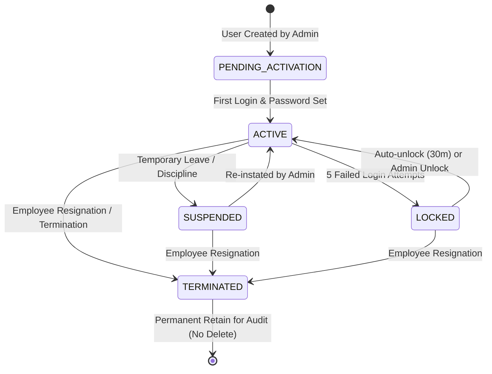
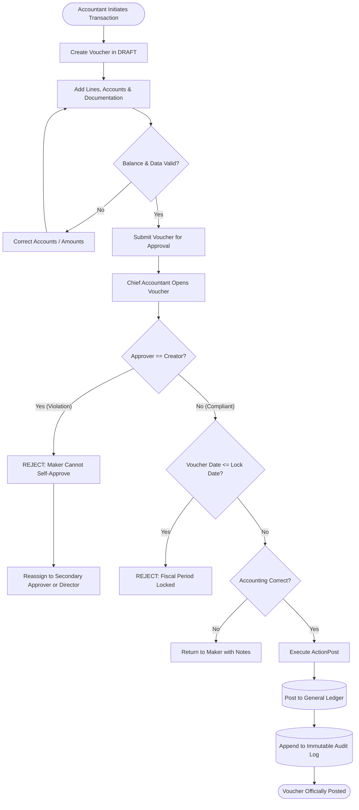

# Business Requirements Document (BRD) & Statutory Specification
## Module: `User`, `Role`, `Permission` & Access Control (Hệ thống Người dùng, Vai trò & Phân quyền)

```
Document Reference : BRD-FIN-SYS-003
Version            : 1.0.0
Classification     : Statutory Specification / Production-Ready BRD
Authors            : Lead Business Analyst (20+ yrs VAS/ERP) & Lead Chief Accountant (20+ yrs VAS, Circular 99/2025, Law 88/2015 Lead)
Reviewers          : Principal Software Engineer, QA/QC Leader, Security Officer
Approvers          : Chief Technology Officer (CTO), Board of Management
Effective Date     : 2026-09-20
Status             : APPROVED / NORMATIVE SPECIFICATION
Target Platform    : FinGo (SME Accounting Desktop Application)
```

---

# 1. Production Readiness Audit: Current App vs. Statutory Reality

### Executive Verdict: **CANNOT OPERATE IN PRODUCTION (CRITICAL FAIL)**

The existing codebase stubs in `internal/domain/system/system.go` are completely unviable for production deployment in any Vietnamese enterprise. Deploying the current implementation would expose the business and its executive leadership to severe regulatory penalties, fraud risk, and criminal liability under the Law on Accounting and the Penal Code.

### Current Codebase Assessment:
1. **Domain Layer**: Primitive, unvalidated stubs. `User` has no status lifecycle, no multi-tenant identifier, no employee linkage, no credential security constraints, and no digital signature association. `Role` is a flat string enum without hierarchy. `Permission` lacks resource-level or data-level scope.
2. **Database Schema**: **0% implementation**. The tables `users`, `roles`, `permissions`, `user_roles`, `role_permissions`, `user_org_unit_scopes`, and `sod_rules` do not exist in MariaDB.
3. **Authorization Engine**: Completely absent. There is zero middleware or domain enforcement intercepting voucher creation, posting, period closing, or report generation.
4. **Data Scoping (Row-Level Security)**: Non-existent. Any authenticated user can view and modify all records across all branches, warehouses, and bank accounts.

### Critical Business & Statutory Failure Points:

1. **Direct Violation of the Law on Accounting No. 88/2015/QH13 (Articles 51, 52, 53 & 54)**:
   - **Article 52 (Incompatibility & Conflict of Interest)**: Vietnamese law strictly prohibits a cashier (*Thủ quỹ*), storekeeper (*Thủ kho*), or asset purchasing/sales officer from acting as an accountant or Chief Accountant (*Kế toán trưởng*) within the same entity. The current app allows any user to execute vouchers, receive cash, and manage inventory without boundary.
   - **Kinship Prohibitions (Article 52, Clause 3)**: Spouses, parents, children, and siblings of the legal representative or Chief Accountant are prohibited from serving as cashier or storekeeper in the same enterprise. The system has zero validation for familial relationship declarations.
2. **Breach of Circular 99/2025/TT-BTC & Circular 133/2016/TT-BTC (Internal Controls & Maker-Checker)**:
   - Mandatory internal control principles require the **Four-Eyes Principle (Nguyên tắc Bốn mắt)**: The voucher creator (*Người lập*) MUST NOT be the voucher approver/poster (*Người phê duyệt/Kế toán trưởng*). Currently, an operator can draft a fictitious payment and immediately post it to the General Ledger.
3. **Breach of Decree 123/2020/NĐ-CP & Circular 32/2025/TT-BTC (Electronic Invoicing Controls)**:
   - E-invoices require rigorous delegation of digital signing authority (*Chữ ký số*). Sales clerks must only create draft e-invoices; only authorized signatories (Director, Chief Accountant, or delegated representative with formal Power of Attorney) may apply the cryptographic token/HSM signature.
4. **Breach of Personal Data Protection Law (Law No. 91/2025/QH15 & Decree 13/2023/NĐ-CP)**:
   - Financial systems hold highly sensitive personal information (CCCD numbers, individual tax codes, bank accounts, payroll figures). Without granular permission scoping, unauthorized staff can inspect executive salaries and sensitive employee PII, triggering immediate statutory liability.
5. **Breach of Law on Electronic Transactions No. 20/2023/QH15 & Law on Accounting (Audit Trail Immutability)**:
   - Electronic accounting records require non-repudiation (*Tính chống chối bỏ*). Without cryptographically verifiable user IDs, IP logging, and before/after change tracking on every single mutation, books fail statutory tax audits and cannot be admitted as legal evidence in court.

---

# 2. Vietnamese Legal & Regulatory Framework

| Legislation / Normative Standard | Regulatory Authority | Mandatory Statutory Requirement for Identity & Access Control |
| :--- | :--- | :--- |
| **Luật Kế toán số 88/2015/QH13** (Điều 13, 18, 51–55) | Quốc hội | Defines qualifications of accountants; establishes **strict statutory incompatibility (Điều 52)**; mandates immutable audit trails for electronic vouchers; establishes legal liability of Chief Accountant. |
| **Thông tư 99/2025/TT-BTC** (Điều 4, 5, 8 & Phụ lục Kiểm soát nội bộ) | Bộ Tài chính | Mandatory internal control system; separation of custody and accounting; tiered authority for signing vouchers, approvals, and financial statement publication. |
| **Thông tư 133/2016/TT-BTC** (Điều 73, 74) | Bộ Tài chính | Establishes SME accounting controls; validates voucher signing responsibilities (Người lập, Kế toán trưởng, Giám đốc, Thủ quỹ). |
| **Nghị định 123/2020/NĐ-CP & Thông tư 32/2025/TT-BTC** | Chính phủ / Bộ Tài chính | Governs e-invoicing workflows; mandates role separation between invoice drafter, invoice reviewer, and digital signature holder. |
| **Luật Giao dịch điện tử số 20/2023/QH15** | Quốc hội | Establishes legal validity of electronic signatures and authentication; defines legal liability of system accounts executing electronic transactions. |
| **Luật Bảo vệ dữ liệu cá nhân số 91/2025/QH15 & NĐ 13/2023/NĐ-CP** | Quốc hội / Chính phủ | Mandates strict Role-Based Access Control (RBAC) and data isolation on sensitive employee payroll, bank details, and personal identification data. |
| **Chuẩn mực Kiểm toán Việt Nam (VSA 240, VSA 315)** | VACPA / Bộ Tài chính | Evaluation of internal controls; assessment of fraud risks related to override of controls; segregation of duties across financial workflows. |
| **COSO Internal Control - Integrated Framework** | VACPA / Quốc tế | Control Environment & Control Activities: segregation of authorization, recording, custody, and reconciliation. |

---

# 3. Domain Model & Class Taxonomy

### 3.1 Domain Architecture & Entities

```go
package system

import (
	"errors"
	"regexp"
	"strings"
	"time"
)

// UserStatus represents the lifecycle state of a user account
type UserStatus string

const (
	UserStatusPendingActivation UserStatus = "PENDING_ACTIVATION" // Mới tạo, chờ kích hoạt / đổi mật khẩu
	UserStatusActive            UserStatus = "ACTIVE"             // Đang hoạt động bình thường
	UserStatusSuspended         UserStatus = "SUSPENDED"          // Tạm đình chỉ (nghỉ việc tạm thời, kỷ luật)
	UserStatusLocked            UserStatus = "LOCKED"             // Khóa do nhập sai mật khẩu quá 5 lần
	UserStatusTerminated        UserStatus = "TERMINATED"         // Đã nghỉ việc (Vô hiệu hóa vĩnh viễn, giữ dữ liệu kiểm toán)
)

// ActionType defines the atomic operations permitted on financial domain resources
type ActionType string

const (
	ActionView     ActionType = "VIEW"     // Xem danh sách và chi tiết
	ActionCreate   ActionType = "CREATE"   // Lập mới chứng từ / danh mục
	ActionUpdate   ActionType = "UPDATE"   // Chỉnh sửa chứng từ ở trạng thái DRAFT
	ActionDelete   ActionType = "DELETE"   // Xóa chứng từ ở trạng thái DRAFT
	ActionPost     ActionType = "POST"     // Ghi sổ Cái (Chuyển vào sổ sách kế toán chính thức)
	ActionUnpost   ActionType = "UNPOST"   // Bỏ ghi sổ (Rút chứng từ về trạng thái nháp để điều chỉnh)
	ActionApprove  ActionType = "APPROVE"  // Phê duyệt thanh toán / mua hàng / chi lương
	ActionLock     ActionType = "LOCK"     // Khóa kỳ kế toán (Chốt sổ không cho sửa)
	ActionExport   ActionType = "EXPORT"   // Xuất dữ liệu ra Excel, PDF, XML
	ActionSign     ActionType = "SIGN"     // Ký số điện tử (USB Token / HSM / Cloud CA)
)

// ResourceModule defines the major functional accounting modules
type ResourceModule string

const (
	ModuleSystem     ResourceModule = "SYSTEM"     // Cấu hình hệ thống, người dùng, chi nhánh
	ModuleCatalog    ResourceModule = "CATALOG"    // Danh mục khách hàng, nhà cung cấp, tài khoản, kho
	ModuleGL         ResourceModule = "GL"         // Sổ cái, bút toán tổng hợp, kết chuyển
	ModuleCash       ResourceModule = "CASH"       // Thu, chi tiền mặt, ngân hàng
	ModuleSales      ResourceModule = "SALES"      // Bán hàng, hóa đơn bán ra, công nợ phải thu
	ModulePurchase   ResourceModule = "PURCHASE"   // Mua hàng, hóa đơn đầu vào, công nợ phải trả
	ModuleInventory  ResourceModule = "INVENTORY"  // Nhập, xuất kho, điều chuyển kho
	ModuleAsset      ResourceModule = "ASSET"      // Tài sản cố định, trích khấu hao
	ModuleTax        ResourceModule = "TAX"        // Thuế GTGT, TNDN, TNCN, hóa đơn điện tử
	ModulePayroll    ResourceModule = "PAYROLL"    // Tính lương, bảo hiểm xã hội, thuế TNCN
	ModuleReport     ResourceModule = "REPORT"     // Báo cáo tài chính, báo cáo quản trị
	ModuleClosing    ResourceModule = "CLOSING"    // Khóa sổ kỳ kế toán, kết chuyển lãi lỗ
)

// SystemRoleCode defines the authoritative Vietnamese accounting roles
type SystemRoleCode string

const (
	RoleSystemAdmin       SystemRoleCode = "ROLE_SYSTEM_ADMIN"       // Quản trị IT (Không được hạch toán kế toán)
	RoleDirector          SystemRoleCode = "ROLE_DIRECTOR"           // Giám đốc / Người đại diện pháp luật (Duyệt chi, xem BCTC)
	RoleChiefAccountant   SystemRoleCode = "ROLE_CHIEF_ACCOUNTANT"   // Kế toán trưởng (Duyệt ghi sổ, khóa sổ, ký BCTC)
	RoleGeneralAccountant SystemRoleCode = "ROLE_GENERAL_ACCOUNTANT" // Kế toán tổng hợp (Lập bút toán, đối chiếu, kết chuyển)
	RoleSalesAccountant   SystemRoleCode = "ROLE_SALES_ACCOUNTANT"   // Kế toán bán hàng & công nợ phải thu
	RolePurchaseAccountant SystemRoleCode = "ROLE_PURCHASE_ACCOUNTANT"// Kế toán mua hàng & công nợ phải trả
	RoleCashier           SystemRoleCode = "ROLE_CASHIER"            // Thủ quỹ (Thực hiện thu/chi tiền mặt, quản lý két)
	RoleWarehouseKeeper   SystemRoleCode = "ROLE_WAREHOUSE_KEEPER"   // Thủ kho (Xác nhận nhập/xuất kho vật lý)
	RoleAuditor           SystemRoleCode = "ROLE_AUDITOR"            // Kiểm toán viên / Ban kiểm soát (Read-only toàn hệ thống)
)

// User represents an enterprise operator within the accounting system
type User struct {
	ID                     string     `json:"id"`
	CompanyProfileID       string     `json:"company_profile_id"`
	Username               string     `json:"username"`
	Email                  string     `json:"email"`
	PasswordHash           string     `json:"-"`
	FullName               string     `json:"full_name"`
	Title                  string     `json:"title"`                   // Chức danh công việc
	EmployeeCode           string     `json:"employee_code,omitempty"` // Mã nhân viên liên kết
	Status                 UserStatus `json:"status"`
	
	// Security & Credential Policies
	FailedLoginAttempts    int        `json:"failed_login_attempts"`
	LockoutUntil           *time.Time `json:"lockout_until,omitempty"`
	PasswordChangedAt      time.Time  `json:"password_changed_at"`
	MustChangePasswordNext bool       `json:"must_change_password_next"`
	MFASecret              string     `json:"-"`
	IsMFAEnabled           bool       `json:"is_mfa_enabled"`
	
	// Digital Signature Binding (Decree 123 & Law 20/2023)
	DigitalCertSubject     string     `json:"digital_cert_subject,omitempty"` // Tên chủ thể trên chứng thư số
	DigitalCertSerial      string     `json:"digital_cert_serial,omitempty"`  // Số serial chứng thư số
	
	// Audit Timestamps
	LastLoginAt            *time.Time `json:"last_login_at,omitempty"`
	LastLoginIP            string     `json:"last_login_ip,omitempty"`
	CreatedAt              time.Time  `json:"created_at"`
	UpdatedAt              time.Time  `json:"updated_at"`
}

// Role defines an organizational permission bundle
type Role struct {
	ID          string         `json:"id"`
	Code        SystemRoleCode `json:"code"`
	Name        string         `json:"name"`
	Description string         `json:"description"`
	IsSystem    bool           `json:"is_system"` // Role chuẩn hệ thống không thể xóa
	CreatedAt   time.Time      `json:"created_at"`
	UpdatedAt   time.Time      `json:"updated_at"`
}

// Permission defines atomic authorization on a resource
type Permission struct {
	ID          string         `json:"id"`
	Code        string         `json:"code"` // e.g. "GL_VOUCHER_POST", "SALES_INVOICE_SIGN"
	Module      ResourceModule `json:"module"`
	Resource    string         `json:"resource"` // e.g. "vouchers", "invoices", "bank_accounts"
	Action      ActionType     `json:"action"`
	Description string         `json:"description"`
}

// UserOrgUnitScope defines Row-Level Security: which branches/departments a user can access
type UserOrgUnitScope struct {
	ID             string    `json:"id"`
	UserID         string    `json:"user_id"`
	OrgUnitID      string    `json:"org_unit_id"`
	IsDefault      bool      `json:"is_default"`       // Chi nhánh mặc định khi đăng nhập
	IncludeChildren bool     `json:"include_children"` // Truy cập luôn các địa điểm KD/phòng ban trực thuộc
	CreatedAt      time.Time `json:"created_at"`
}

// SoDConflictRule defines statutory and operational incompatibility between roles
type SoDConflictRule struct {
	RoleA       SystemRoleCode `json:"role_a"`
	RoleB       SystemRoleCode `json:"role_b"`
	LegalBasis  string         `json:"legal_basis"` // e.g. "Điều 52 Luật Kế toán 88/2015/QH13"
	Description string         `json:"description"`
}
```

---

# 4. Business Rules & Statutory Invariants

### 4.1 Invariant Rules Definition (Normative RFC 2119)

| Rule ID | Rule Name | Normative Requirement | Legal / Control Basis | Enforcement Layer |
| :--- | :--- | :--- | :--- | :--- |
| **BR-SEC-01** | **Segregation of Incompatible Roles (Bất kiêm nhiệm)** | A single user **MUST NOT** be concurrently assigned: (1) `ROLE_CASHIER` and any Accounting role; (2) `ROLE_WAREHOUSE_KEEPER` and any Accounting role; (3) `ROLE_SYSTEM_ADMIN` and any Accounting/Financial role. | Điều 52, Khoản 2, Luật Kế toán 88/2015/QH13. | Domain Entity & Service Validator. |
| **BR-SEC-02** | **Maker-Checker Invariant (Nguyên tắc Bốn mắt)** | The user who created or last modified a voucher/payment (`CreatorID`) **MUST NOT** be the user who approves or posts that voucher (`ApproverID != CreatorID`). Attempting self-approval MUST return `ErrMakerCheckerViolation`. | Thông tư 99/2025/TT-BTC (Kiểm soát nội bộ); VSA 240. | Domain Voucher State Machine & Usecase. |
| **BR-SEC-03** | **Posting & Unposting Authority** | Only users with `ROLE_CHIEF_ACCOUNTANT` or explicitly delegated `ROLE_GENERAL_ACCOUNTANT` **MAY** execute `ActionPost` or `ActionUnpost` on the General Ledger. | Điều 53, 54 Luật Kế toán 88/2015/QH13. | Authorization Middleware. |
| **BR-SEC-04** | **Period Lock / Unlock Authority** | Modifying system lock dates or re-opening a closed fiscal period **MUST** require explicit authorization by `ROLE_CHIEF_ACCOUNTANT` or `ROLE_DIRECTOR`. Re-opening MUST record a mandatory justification and emit a high-priority audit event. | Điều 13, Khoản 8 Luật Kế toán 88/2015/QH13. | Domain Closing Service. |
| **BR-SEC-05** | **Digital Signature Authorization** | Only users granted `ActionSign` linked to a verified cryptographic certificate **MUST** be permitted to sign Decree 123 E-Invoices or VAT tax filings. | Nghị định 123/2020/NĐ-CP & Luật Giao dịch điện tử 20/2023. | E-Invoice Usecase Service. |
| **BR-SEC-06** | **Multi-Branch Row-Level Isolation** | A user assigned specific `OrgUnitID` scopes **MUST NOT** view, create, edit, or post transactions belonging to other branches. An attempt to access out-of-scope branch data MUST return `ErrOrgUnitAccessDenied`. | Thông tư 80/2021/TT-BTC; Thông tư 99/2025/TT-BTC. | SQL Query Layer & Service Boundary. |
| **BR-SEC-07** | **Password Security & Brute-Force Lockout** | Passwords **MUST** be hashed using `bcrypt` (work factor $\ge 12$). Upon **5 consecutive failed login attempts**, the account **MUST** be automatically locked (`UserStatusLocked`) for 30 minutes, or until unlocked by an Admin. | OWASP ASVS v4.0; TCVN 11945:2017. | Authentication Service. |
| **BR-SEC-08** | **Statutory Kinship Declarations** | When assigning `ROLE_CHIEF_ACCOUNTANT` or `ROLE_CASHIER`, the system **MUST** verify and log that the user is not a declared spouse, parent, child, or sibling of the Legal Representative. | Điều 52, Khoản 3 Luật Kế toán 88/2015/QH13. | User Management Usecase. |
| **BR-SEC-09** | **Sensitive Data Masking (Salary & Personal Tax Codes)** | Access to `ModulePayroll` and sensitive employee bank details **MUST** be restricted to `ROLE_CHIEF_ACCOUNTANT` and HR/Payroll accountants. Logs **MUST** mask personal tax codes and ID numbers. | Luật Bảo vệ dữ liệu cá nhân 91/2025/QH15. | Logger & UI Serialization. |
| **BR-SEC-10** | **Immutable Audit Log Retention** | All user authentication events, permission changes, voucher posting, and period locking **MUST** be appended to `audit_logs` with `Timestamp`, `UserID`, `IP`, `Action`, `BeforeState`, `AfterState`. Records **MUST NOT** be modified or deleted for 10 years. | Điều 18 & 41 Luật Kế toán 88/2015/QH13. | Database Immutability Trigger / WORM. |

---

# 5. Segregation of Duties (SoD) Conflict Matrix

The following matrix formally specifies role incompatibilities mandated by Vietnamese law and internal auditing standards:

| Assigned Role $\downarrow$ \ Attempted Role $\to$ | Admin | Director | Chief Accountant | General Accountant | Sales Accountant | Purchase Accountant | Cashier (Thủ quỹ) | Warehouse (Thủ kho) | Auditor |
| :--- | :---: | :---: | :---: | :---: | :---: | :---: | :---: | :---: | :---: |
| **System Admin** | — | **DENY** | **DENY** | **DENY** | **DENY** | **DENY** | **DENY** | **DENY** | **DENY** |
| **Director (GĐ)** | **DENY** | — | **DENY** (1) | ALLOW | ALLOW | ALLOW | **DENY** (2) | **DENY** (2) | **DENY** |
| **Chief Accountant (KTT)** | **DENY** | **DENY** | — | ALLOW | ALLOW | ALLOW | **DENY** (3) | **DENY** (3) | **DENY** |
| **General Accountant** | **DENY** | ALLOW | ALLOW | — | ALLOW | ALLOW | **DENY** (3) | **DENY** (3) | **DENY** |
| **Sales Accountant** | **DENY** | ALLOW | ALLOW | ALLOW | — | ALLOW | **DENY** (3) | **DENY** (3) | **DENY** |
| **Purchase Accountant**| **DENY** | ALLOW | ALLOW | ALLOW | ALLOW | — | **DENY** (3) | **DENY** (3) | **DENY** |
| **Cashier (Thủ quỹ)** | **DENY** | **DENY** | **DENY** | **DENY** | **DENY** | **DENY** | — | **DENY** (4) | **DENY** |
| **Warehouse (Thủ kho)**| **DENY** | **DENY** | **DENY** | **DENY** | **DENY** | **DENY** | **DENY** | — | **DENY** |
| **Auditor (Kiểm toán)**| **DENY** | **DENY** | **DENY** | **DENY** | **DENY** | **DENY** | **DENY** | **DENY** | — |

*Notes on Statutory Denial Codes:*
1. **(1) Law 88/2015 Điều 52.1**: Giám đốc/Người đại diện không được kiêm Kế toán trưởng (trừ doanh nghiệp siêu nhỏ theo NĐ 39/2018/NĐ-CP).
2. **(2) Law 88/2015 Điều 52.2**: Người quản lý, điều hành không được kiêm thủ quỹ, thủ kho.
3. **(3) Law 88/2015 Điều 52.2 & Thông tư 99/2025/TT-BTC**: Người đang làm kế toán không được kiêm thủ kho, thủ quỹ trong cùng một đơn vị kế toán.
4. **(4) Thông tư 99/2025/TT-BTC & COSO**: Bất kiêm nhiệm giữa quản lý tiền mặt (Két) và hàng tồn kho (Kho vật chất).

---

# 6. Complete Use Cases & Scenarios

### UC-01: Provision New User & Assign Roles with SoD Validation
- **Primary Actor**: System Administrator (`ROLE_SYSTEM_ADMIN`).
- **Preconditions**: Administrator is logged in; Tenant company profile exists.
- **Trigger**: New accounting personnel joins enterprise.
- **Main Flow (Happy Path)**:
  1. Admin navigates to **User Management** $\to$ **New User**.
  2. Admin inputs Full Name, Username, Corporate Email, Title, Employee Code.
  3. System validates email format, username uniqueness, and password strength (min 8 chars, uppercase, lowercase, numbers, special symbols).
  4. Admin selects Roles: `ROLE_GENERAL_ACCOUNTANT`.
  5. System validates selected roles against the **SoD Conflict Matrix**. No conflicts detected.
  6. Admin selects Branch/OrgUnit Scopes: `CN_HO_CHI_MINH` (Default: Yes, Include Children: Yes).
  7. Admin saves. System persists User, UserRoles, and UserOrgUnitScopes within an ACID transaction.
  8. System sends activation email with single-use temporary password token (valid 24h).
  9. System emits `USER_CREATED` audit event.
- **Alternative Flow (SME Single Owner Exception)**:
  - If tenant is registered as a Single-Member Limited Liability Company (Công ty TNHH 1 TV do cá nhân làm chủ), statutory exception under Điều 52, Khoản 4 Law 88/2015 applies: Director can assume Chief Accountant duties. The system requires an explicit statutory exception waiver toggle accompanied by corporate registration confirmation.
- **Exception Flow E-01 (SoD Violation Attempt)**:
  - Admin attempts to assign both `ROLE_CHIEF_ACCOUNTANT` and `ROLE_CASHIER` to the same user.
  - System intercepts: Returns `ErrSoDConflictViolation: "Violates Article 52 Law on Accounting 88/2015/QH13: Cashier cannot concurrently hold Accounting duties."`
  - Transaction is aborted; audit log records `SOD_ASSIGNMENT_REJECTED`.

---

### UC-02: User Authentication & Multi-Factor Challenge
- **Primary Actor**: User (e.g. Chief Accountant).
- **Preconditions**: User status is `ACTIVE`.
- **Main Flow (Happy Path)**:
  1. User inputs Username and Password into FinGo Desktop UI.
  2. Backend fetches user, verifies status is `ACTIVE`, and verifies password hash using `bcrypt.CompareHashAndPassword`.
  3. If password matches and MFA is enabled, system prompts for 6-digit TOTP token.
  4. User inputs TOTP code; system verifies code within time-step window.
  5. System resets `FailedLoginAttempts = 0`, updates `LastLoginAt` and `LastLoginIP`.
  6. System issues an authenticated session token with embedded claims (UserID, TenantID, Roles, Scopes).
- **Exception Flow E-01 (Brute-Force Lockout)**:
  1. User inputs wrong password.
  2. System increments `FailedLoginAttempts`.
  3. On 5th consecutive failure, system sets `Status = LOCKED` and `LockoutUntil = NOW() + 30 minutes`.
  4. System emits security audit alert `USER_ACCOUNT_LOCKED`. Subsequent login attempts return `ErrAccountLockedUntil`.

---

### UC-03: Four-Eyes Principle Voucher Approval & Posting
- **Primary Actors**:
  - Maker: Sales Accountant (`ROLE_SALES_ACCOUNTANT`).
  - Checker: Chief Accountant (`ROLE_CHIEF_ACCOUNTANT`).
- **Main Flow (Happy Path)**:
  1. Sales Accountant drafts a Sales Voucher (Voucher No: `HDBR-2026-00142`) for 500,000,000 VND.
  2. Sales Accountant submits voucher for review. Voucher enters status `SUBMITTED`.
  3. Chief Accountant opens Pending Vouchers review dashboard.
  4. Chief Accountant reviews account mappings (Debit 131, Credit 511, Credit 33311), invoice attachments, and VAT math.
  5. Chief Accountant clicks **Phê duyệt & Ghi sổ (Approve & Post)**.
  6. Domain engine validates:
     - `User.HasPermission("GL_VOUCHER_POST") == true`.
     - `Voucher.CreatedBy != CurrentUser.ID` (Enforces Maker-Checker invariant).
     - `Voucher.VoucherDate > CompanyProfile.LockDate` (Period lock check).
     - `sum(Debits) == sum(Credits)` (Double-entry equilibrium).
  7. Voucher is transitioned to `POSTED`; general ledger balances updated.
  8. System records `VOUCHER_POSTED` with `PostedBy = ChiefAccountant.ID`, `Timestamp = NOW()`.
- **Exception Flow E-01 (Self-Approval Attempt)**:
  1. Chief Accountant creates a General Voucher directly.
  2. Chief Accountant attempts to immediately click "Ghi sổ" without a secondary approver.
  3. Domain engine intercepts: `CreatedBy == CurrentUser.ID`.
  4. System rejects action: returns `ErrMakerCheckerViolation: "Maker cannot approve own voucher. A secondary Chief Accountant or Director approval is required."`
  5. Voucher remains in `DRAFT`/`SUBMITTED` state.

---

### UC-04: Decree 123 E-Invoice Signing & Issuance Delegation
- **Primary Actor**: Director or Authorized Signatory with Power of Attorney (`Giấy ủy quyền ký hóa đơn`).
- **Preconditions**: Sales invoice is in status `APPROVED`; USB Token or Cloud CA digital certificate is active.
- **Main Flow (Happy Path)**:
  1. User opens approved sales invoice `INV-2026-0089`.
  2. User selects **Ký số & Phát hành hóa đơn điện tử (Digitally Sign & Issue)**.
  3. System verifies user has permission `EINV_INVOICE_SIGN`.
  4. System verifies user's digital certificate serial matches registered subject.
  5. System builds canonical Decree 123 XML payload, computes SHA-256 digest, and executes XMLDSig digital signature using crypto provider.
  6. Signed XML is transmitted to General Department of Taxation (GDT) gateway.
  7. Tax authority returns validation response with GDT authentication code (*Mã của cơ quan thuế*).
  8. Invoice status updated to `ISSUED_WITH_CODE`. Audit log captures digital certificate details.
- **Exception Flow E-01 (Unauthorized Signatory Attempt)**:
  1. Junior sales accountant attempts to trigger digital signing.
  2. System verifies user permissions: `EINV_INVOICE_SIGN` is absent.
  3. Operation aborted with `403 Forbidden: ErrSignatoryAuthorityRequired`.

---

### UC-05: Fiscal Period Locking & Emergency Re-Opening
- **Primary Actor**: Chief Accountant (`ROLE_CHIEF_ACCOUNTANT`).
- **Preconditions**: Month-end closing reconciliations complete; Trial Balance in equilibrium.
- **Main Flow (Happy Path)**:
  1. Chief Accountant navigates to **Closing & Period Management**.
  2. Sets `LockDate = 2026-03-31` for Branch `CN_HO_CHI_MINH`.
  3. System verifies all pre-closing rules (P&L transferred to 911/421; zero unposted draft vouchers before lock date).
  4. System updates `BranchOrgUnit.LockDate` and emits `PERIOD_LOCKED` audit log.
  5. From this moment, any attempt by any user to create, edit, or delete transactions dated $\le$ 2026-03-31 is blocked with `ErrPeriodLocked`.
- **Alternative Flow (Emergency Re-Opening with Justification)**:
  1. Tax audit requires adjusting an entry dated 2026-02-15.
  2. Chief Accountant initiates **Re-open Period**.
  3. System prompts for: (a) Mandatory written justification (minimum 50 characters); (b) Director's counter-approval code; (c) Password re-verification.
  4. System unlocks period temporarily to designated target date, emitting high-priority security alert to executive stakeholders.

---

# 7. State Machines & Visual Workflows

### 7.1 User Lifecycle State Machine



### 7.2 Voucher Maker-Checker Flowchart (Law 88/2015 & TT 99/2025)



---

# 8. Database Schema Specification (MariaDB 12.3)

Migration: `00004_create_user_role_permission.sql`

```sql
-- +goose Up
-- Migration: Create User, Role, Permission and Security Access Control Schema

-- 1. Users Table
CREATE TABLE IF NOT EXISTS users (
    id VARCHAR(36) PRIMARY KEY,
    company_profile_id VARCHAR(36) NOT NULL,
    username VARCHAR(64) NOT NULL,
    email VARCHAR(255) NOT NULL,
    password_hash VARCHAR(255) NOT NULL,
    full_name VARCHAR(255) NOT NULL,
    title VARCHAR(100) NULL,
    employee_code VARCHAR(64) NULL,
    status ENUM('PENDING_ACTIVATION', 'ACTIVE', 'SUSPENDED', 'LOCKED', 'TERMINATED') NOT NULL DEFAULT 'PENDING_ACTIVATION',
    failed_login_attempts INT NOT NULL DEFAULT 0,
    lockout_until TIMESTAMP NULL,
    password_changed_at TIMESTAMP NOT NULL DEFAULT CURRENT_TIMESTAMP,
    must_change_password_next BOOLEAN NOT NULL DEFAULT TRUE,
    mfa_secret VARCHAR(128) NULL,
    is_mfa_enabled BOOLEAN NOT NULL DEFAULT FALSE,
    digital_cert_subject VARCHAR(255) NULL,
    digital_cert_serial VARCHAR(128) NULL,
    last_login_at TIMESTAMP NULL,
    last_login_ip VARCHAR(64) NULL,
    created_at TIMESTAMP NOT NULL DEFAULT CURRENT_TIMESTAMP,
    updated_at TIMESTAMP NOT NULL DEFAULT CURRENT_TIMESTAMP ON UPDATE CURRENT_TIMESTAMP,
    CONSTRAINT fk_users_company FOREIGN KEY (company_profile_id) REFERENCES company_profiles(id),
    CONSTRAINT uq_users_company_username UNIQUE (company_profile_id, username),
    CONSTRAINT uq_users_company_email UNIQUE (company_profile_id, email)
) ENGINE=InnoDB DEFAULT CHARSET=utf8mb4 COLLATE=utf8mb4_unicode_ci;

-- 2. Roles Table
CREATE TABLE IF NOT EXISTS roles (
    id VARCHAR(36) PRIMARY KEY,
    code VARCHAR(64) NOT NULL UNIQUE,
    name VARCHAR(100) NOT NULL,
    description VARCHAR(255) NULL,
    is_system BOOLEAN NOT NULL DEFAULT FALSE,
    created_at TIMESTAMP NOT NULL DEFAULT CURRENT_TIMESTAMP,
    updated_at TIMESTAMP NOT NULL DEFAULT CURRENT_TIMESTAMP ON UPDATE CURRENT_TIMESTAMP
) ENGINE=InnoDB DEFAULT CHARSET=utf8mb4 COLLATE=utf8mb4_unicode_ci;

-- 3. Permissions Table
CREATE TABLE IF NOT EXISTS permissions (
    id VARCHAR(36) PRIMARY KEY,
    code VARCHAR(64) NOT NULL UNIQUE,
    module VARCHAR(32) NOT NULL,
    resource VARCHAR(64) NOT NULL,
    action VARCHAR(32) NOT NULL,
    description VARCHAR(255) NULL,
    CONSTRAINT uq_perm_resource_action UNIQUE (module, resource, action)
) ENGINE=InnoDB DEFAULT CHARSET=utf8mb4 COLLATE=utf8mb4_unicode_ci;

-- 4. User-Role Association (N-N)
CREATE TABLE IF NOT EXISTS user_roles (
    user_id VARCHAR(36) NOT NULL,
    role_id VARCHAR(36) NOT NULL,
    assigned_at TIMESTAMP NOT NULL DEFAULT CURRENT_TIMESTAMP,
    assigned_by VARCHAR(36) NULL,
    PRIMARY KEY (user_id, role_id),
    CONSTRAINT fk_user_roles_user FOREIGN KEY (user_id) REFERENCES users(id) ON DELETE CASCADE,
    CONSTRAINT fk_user_roles_role FOREIGN KEY (role_id) REFERENCES roles(id) ON DELETE CASCADE
) ENGINE=InnoDB DEFAULT CHARSET=utf8mb4 COLLATE=utf8mb4_unicode_ci;

-- 5. Role-Permission Association (N-N)
CREATE TABLE IF NOT EXISTS role_permissions (
    role_id VARCHAR(36) NOT NULL,
    permission_id VARCHAR(36) NOT NULL,
    PRIMARY KEY (role_id, permission_id),
    CONSTRAINT fk_role_perms_role FOREIGN KEY (role_id) REFERENCES roles(id) ON DELETE CASCADE,
    CONSTRAINT fk_role_perms_perm FOREIGN KEY (permission_id) REFERENCES permissions(id) ON DELETE CASCADE
) ENGINE=InnoDB DEFAULT CHARSET=utf8mb4 COLLATE=utf8mb4_unicode_ci;

-- 6. User OrgUnit / Branch Data Scope (Row-Level Security)
CREATE TABLE IF NOT EXISTS user_org_unit_scopes (
    id VARCHAR(36) PRIMARY KEY,
    user_id VARCHAR(36) NOT NULL,
    org_unit_id VARCHAR(36) NOT NULL,
    is_default BOOLEAN NOT NULL DEFAULT FALSE,
    include_children BOOLEAN NOT NULL DEFAULT TRUE,
    created_at TIMESTAMP NOT NULL DEFAULT CURRENT_TIMESTAMP,
    CONSTRAINT fk_user_scopes_user FOREIGN KEY (user_id) REFERENCES users(id) ON DELETE CASCADE,
    CONSTRAINT fk_user_scopes_org_unit FOREIGN KEY (org_unit_id) REFERENCES branch_org_units(id) ON DELETE CASCADE,
    CONSTRAINT uq_user_scope UNIQUE (user_id, org_unit_id)
) ENGINE=InnoDB DEFAULT CHARSET=utf8mb4 COLLATE=utf8mb4_unicode_ci;

-- 7. Statutory Segregation of Duties Conflict Rules Table
CREATE TABLE IF NOT EXISTS sod_conflict_rules (
    id VARCHAR(36) PRIMARY KEY,
    role_code_a VARCHAR(64) NOT NULL,
    role_code_b VARCHAR(64) NOT NULL,
    legal_basis VARCHAR(255) NOT NULL,
    description VARCHAR(500) NOT NULL,
    CONSTRAINT uq_sod_pair UNIQUE (role_code_a, role_code_b)
) ENGINE=InnoDB DEFAULT CHARSET=utf8mb4 COLLATE=utf8mb4_unicode_ci;

-- 8. Enhanced Audit Logs Table (Statutory Law 88/2015 10-year Retention)
CREATE TABLE IF NOT EXISTS audit_logs (
    id VARCHAR(36) PRIMARY KEY,
    company_profile_id VARCHAR(36) NOT NULL,
    user_id VARCHAR(36) NULL,
    action VARCHAR(64) NOT NULL,
    entity_name VARCHAR(64) NOT NULL,
    entity_id VARCHAR(64) NOT NULL,
    pre_change_state JSON NULL,
    post_change_state JSON NULL,
    client_ip VARCHAR(64) NULL,
    user_agent VARCHAR(255) NULL,
    trace_id VARCHAR(64) NULL,
    created_at TIMESTAMP NOT NULL DEFAULT CURRENT_TIMESTAMP,
    INDEX idx_audit_company_entity (company_profile_id, entity_name, entity_id),
    INDEX idx_audit_user (user_id),
    INDEX idx_audit_created_at (created_at)
) ENGINE=InnoDB DEFAULT CHARSET=utf8mb4 COLLATE=utf8mb4_unicode_ci;

-- +goose Down
DROP TABLE IF EXISTS audit_logs;
DROP TABLE IF EXISTS sod_conflict_rules;
DROP TABLE IF EXISTS user_org_unit_scopes;
DROP TABLE IF EXISTS role_permissions;
DROP TABLE IF EXISTS user_roles;
DROP TABLE IF EXISTS permissions;
DROP TABLE IF EXISTS roles;
DROP TABLE IF EXISTS users;
```

---

# 9. Implementation Roadmap & Phased Execution Plan

The implementation follows Test-Driven Development (TDD) as mandated by the project standards:

```
                  PHASED IMPLEMENTATION TIMELINE
┌────────────────────────────────────────────────────────────────────────┐
│ Phase 1: Pure Domain Layer (internal/domain/system)                    │
│ • Domain Entities: User, Role, Permission, UserOrgUnitScope.           │
│ • Value Objects: PasswordPolicy, UserStatus state machine.             │
│ • SoD Conflict Detection Engine & Table-Driven Unit Tests (100% cover).│
├────────────────────────────────────────────────────────────────────────┤
│ Phase 2: Persistence & Schema (db/migrations & sqlc)                   │
│ • Write Goose Migration 00004_create_user_role_permission.sql.         │
│ • Write queries/user_role_permission.sql.                              │
│ • Generate type-safe SQLC Go models.                                   │
├────────────────────────────────────────────────────────────────────────┤
│ Phase 3: Adapter Layer & Integration Tests                             │
│ • Implement MariaDB UserRepository, RoleRepository, AuditRepository.   │
│ • Integration test suite using testcontainers-go (MariaDB 12.3).       │
│ • Assert unique constraints, foreign keys, and atomic role assignment. │
├────────────────────────────────────────────────────────────────────────┤
│ Phase 4: Usecase & Application Service Layer                           │
│ • Implement AuthUsecase (Login, MFA, Password Lockout).                │
│ • Implement UserManagementUsecase (Create, Update, AssignScope, SoD).   │
│ • Implement AuthorizationGuard (Maker-Checker, ActionPost, ActionSign).│
├────────────────────────────────────────────────────────────────────────┤
│ Phase 5: Wails Handler & Vue 3 Desktop UI Integration                  │
│ • Expose Go backend methods to Wails desktop runtime.                  │
│ • Build User Management, Role Assignment & Permission Matrix views.    │
│ • Implement Four-Eyes Voucher Approval UI with Maker-Checker alerts.   │
└────────────────────────────────────────────────────────────────────────┘
```

---

# 10. Verification & Quality Acceptance Checklist

```markdown
# Statutory Quality Sign-Off: User, Role & Permission Module
Review Date: _____________   Release Target: _____________

[ ] 1. STATUTORY COMPLIANCE (LEGAL VERIFICATION)
    [ ] Law on Accounting 88/2015/QH13 Article 52 enforced: Cashier / Storekeeper CANNOT be assigned Accounting roles.
    [ ] Circular 99/2025/TT-BTC Maker-Checker enforced: Creator of a voucher cannot approve/post that voucher.
    [ ] Decree 123/2020/NĐ-CP E-Invoice digital signature role authority verified.
    [ ] Law 91/2025/QH15 Personal Data Protection: Salary and PII masked in logs and UI.
    [ ] Law 88/2015 10-year immutable audit trail captures UserID, IP, before/after JSON.

[ ] 2. SECURITY & INTEGRITY CONTROLS
    [ ] Bcrypt hashing verified with work factor >= 12.
    [ ] 5 failed login attempts trigger 30-minute automated account lockout.
    [ ] Multi-branch Row-Level Security blocks cross-branch voucher tampering.
    [ ] Zero hardcoded credentials or bypass flags in codebase.

[ ] 3. TESTING METRICS
    [ ] internal/domain/system test line coverage >= 95.0%.
    [ ] MariaDB 12.3 integration tests pass (100%).
    [ ] Microbenchmarks assert auth check latency < 1ms.

-------------------------------------------------------------------------
LEAD CHIEF ACCOUNTANT SIGN-OFF:             QA/QC LEADER SIGN-OFF:
Signature: __________________________       Signature: __________________________
Date:      __________________________       Date:      __________________________
```
