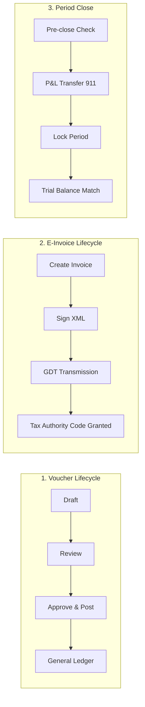
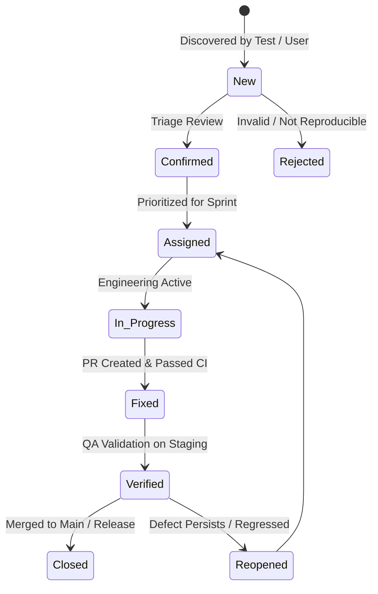
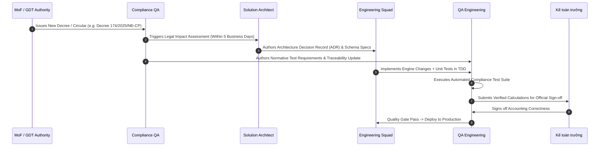

# FinGo Platform: Comprehensive Testing Strategy & Quality Assurance Standards

```
Document Reference : FINGO-QA-STRATEGY-2026-V1
Version            : 1.0.0
Classification     : Internal Enterprise Standard / Audit Normative
Author             : QA/QC Leadership (Financial Systems Practice)
Reviewers          : Chief Solutions Architect, Head of Engineering, Compliance Lead, Lead Chief Accountant (Kế toán trưởng)
Approvers          : Chief Technology Officer (CTO), Head of Product
Effective Date     : 2026-09-20
Retention Period   : 10 Years (Statutory Audit Archive pursuant to Law on Accounting No. 88/2015/QH13)
```

---

## Document Control & Revision History

| Version | Release Date | Author | Reviewer / Approver | Change Summary |
|---|---|---|---|---|
| `1.0.0` | 2026-09-20 | QA/QC Leader | Lead SA, CTO, Lead Chief Accountant | Initial comprehensive release defining quality engineering standards, risk matrices, CI/CD gates, compliance mapping (Circular 99/2025/TT-BTC, Circular 32/2025/TT-BTC, Decree 123/2020/NĐ-CP, Decree 174/2025/NĐ-CP, Law 91/2025/QH15), and audit evidence controls. |

### Executive Mandate

Financial accounting software is not typical CRUD software. In financial systems, a single off-by-one rounding discrepancy, an untracked concurrent journal update, or an inverted debit/credit line constitutes legal misrepresentation, statutory penalty exposure, and immediate loss of tenant trust.

Every technical standard defined herein is **normative** following [RFC 2119](https://www.ietf.org/rfc/rfc2119.txt):
- **MUST / SHALL**: Absolute mandatory requirement. Non-conformance halts releases.
- **MUST NOT**: Absolute prohibition.
- **SHOULD / RECOMMENDED**: Mandatory unless a documented, peer-reviewed engineering justification is formally accepted.
- **MAY / OPTIONAL**: Permitted architectural choice within defined safety guardrails.

---

## 1. Quality Strategy & Risk-Based Testing

### 1.1 Measurable Quality Objectives per Release

Every release candidate (RC) deployed to staging or production MUST satisfy the following empirical metrics:

| Objective Metric | Threshold Target | Measurement Source | Gate Enforcement |
|---|---|---|---|
| **P1 (Critical) Defects in Prod** | **0** | Production Sentry / Audit Logs | Release Blocker |
| **P2 (High) Defects in Prod** | **0** | Production Issue Tracker | Release Blocker |
| **Defect Escape Rate** | **≤ 2.0%** | $\frac{\text{Prod Defects}}{\text{Prod Defects} + \text{Pre-Release Defects}} \times 100$ | Sprint Quality Review |
| **Compliance Test Pass Rate** | **100.0%** (Zero Tolerance) | Automated Compliance Test Suite | Release Blocker |
| **Domain Logic Test Coverage** | **≥ 95.0%** line coverage | `go test -cover ./internal/domain/...` | PR & CI Gate |
| **Service / Usecase Layer Coverage**| **≥ 85.0%** line coverage | `go test -cover ./internal/usecase/...` | CI Pipeline Gate |
| **Diff Coverage (New Code in PR)** | **100.0%** (Domain), **≥ 90.0%** (Adapter) | Codecov / Sonar diff coverage | PR Merge Blocker |
| **Mean Time to Detect (MTTD)** | **< 4 Hours** | Automated canary & regression runtimes | Weekly KPI |
| **Mean Time to Resolve (MTTR) P1**| **< 4 Hours** (Hotfix to Prod) | Incident Management SLA log | Monthly Executive Review |
| **Flaky Test Ratio in CI** | **0.0%** active in gating suites | CI Test Quarantine Log | Weekly Triage |

### 1.2 Risk-Based Test Allocation (Accounting Risk Matrix)

Test intensity is allocated proportional to **Financial Impact $\times$ Regulatory Exposure**:

```
                  FINANCIAL & REGULATORY RISK MATRIX
  ┌─────────────────────────────────────────────────────────────────┐
  │  CRITICAL (Risk Score 16 - 25)                                  │
  │  • Modules: gl (General Ledger), tax, einvoice, closing         │
  │  • Requirements: 100% domain coverage, property-based tests,    │
  │    golden-file byte checks, dual-ledger isolation, chaos runs.  │
  ├─────────────────────────────────────────────────────────────────┤
  │  HIGH (Risk Score 10 - 15)                                      │
  │  • Modules: sales, purchase, cash, inventory, payroll, costing  │
  │  • Requirements: ≥ 90% domain coverage, DB integration suites,  │
  │    strict boundary testing, E2E business flow validation.       │
  ├─────────────────────────────────────────────────────────────────┤
  │  MEDIUM (Risk Score 5 - 9)                                      │
  │  • Modules: catalog, asset, opening, system (RBAC / Auth)      │
  │  • Requirements: ≥ 70% coverage, contract API tests, security   │
  │    permission matrix validation.                                │
  ├─────────────────────────────────────────────────────────────────┤
  │  LOW (Risk Score 1 - 4)                                         │
  │  • Modules: ui handlers, background notifications, export logs  │
  │  • Requirements: ≥ 60% coverage, smoke test suite.              │
  └─────────────────────────────────────────────────────────────────┘
```

#### Risk Re-Assessment Triggers
Risk scores MUST be formally re-evaluated:
1. Upon publication of a new decree/circular by the Ministry of Finance (MoF) or General Department of Taxation (GDT).
2. Immediately following any production P1 or P2 incident.
3. At the architectural design phase of major sub-ledger additions.
4. During scheduled quarterly QA governance reviews.

### 1.3 Enforced Test Pyramid

FinGo strictly enforces a bottom-heavy test pyramid to guarantee execution speed and eradicate flakiness:

| Tier | Ratio Target | Execution Time | Focus Area | Technology |
|---|---|---|---|---|
| **Unit Tests** | **≥ 80%** | < 300 seconds (full suite) | Pure domain invariants, double-entry equality, tax rounding, boundary edge cases. | Go standard library `testing`, pure Go structs, fakes/stubs. |
| **Integration Tests** | **15%** | < 600 seconds | MariaDB transactions, SQLC queries, locking, goose migrations, external API contracts. | `testcontainers-go` (MariaDB 12.3), `httptest`. |
| **E2E / Acceptance** | **≤ 5%** | < 900 seconds | Full user lifecycles, golden report rendering, multi-tenant boundary verifications. | Wails UI headless runner / Playwright / Go orchestration. |

> **20-Year Field Experience Principle**:  
> Brittle, slow end-to-end UI tests rot and breed cynicism. Accounting correctness is proven at the mathematical and state-machine layers. E2E tests are strictly reserved for critical golden paths.

### 1.4 Regression Strategy

1. **Targeted Regression (Per PR)**:
   - Git impact analysis detects modified packages.
   - Modifying `gl/` triggers execution of `gl`, `tax`, `closing`, and `report` suites.
   - Modifying `sales/` triggers `sales`, `tax`, `einvoice`, and `gl` suites.
   - Modifying `payroll/` triggers `payroll`, statutory BHXH/PIT rules, and `gl` suites.
2. **Full Automated Regression (Nightly)**:
   - Executed at 01:00 ICT on Staging using sanitized 10k-entry synthetic ledger data.
   - Includes all integration, E2E, and golden-file verification tests.
3. **Weekend Soak & Goroutine Leak Testing**:
   - Sustained synthetic transaction pipeline for 4 continuous hours.
   - Asserts memory RSS stability and verifies `runtime.NumGoroutine()` baseline parity.

---

## 2. Test Planning & Test Management

### 2.1 Standardized Test Plan Structure

Every release candidate MUST be governed by a structured Test Plan document (`TEST-PLAN-vX.Y.Z.md`) containing:
1. **Scope & Exclusions**: Features under test, deferred items, explicit regulatory boundaries.
2. **Top 5 Release Risks & Mitigations**: Architectural failure modes and verification controls.
3. **Entry Criteria**: Clean CI build, zero P1/P2 defects from prior sprint, database migrations successfully applied to staging schema.
4. **Exit Criteria (Release Quality Gate)**:
   - 100% of Critical and High risk test cases executed and passed.
   - 100% compliance test suite pass rate.
   - Zero open P1/P2 defects; ≤ 3 open P3 defects (each with approved operational workarounds).
   - Performance benchmarks within established SLO budgets.
   - Clean security vulnerability scan (zero high/critical CVEs).
   - Formal sign-off by QA Leader and Chief Accountant.
5. **Environment & Resource Matrix**: Assigned SDETs, QA Engineers, environments, and schedule windows.

### 2.2 Test Case Management & Traceability Matrix

Test cases MUST be managed in a centralized tracking system (TestRail / Jira Xray) with the following mandatory taxonomy:

```
FinGo Test Suite Architecture
├── GL (General Ledger & Vouchers)
│   ├── GL-VOUCHER-BAL : Double-entry balance tests (Debit == Credit)
│   └── GL-LOCK-DATE   : Fiscal period locking & backdating prevention
├── TAX (VAT & CIT Declarations)
│   ├── TAX-VAT-08     : 8% VAT verification under Resolution 204/2025/QH15
│   └── TAX-VAT-10     : Standard 10% VAT calculation & rounding
├── EINVOICE (Decree 123 & Circular 32/2025)
│   ├── EINV-XML-VAL   : XML Schema validation against GDT XSD
│   └── EINV-SEQ-GAP   : Invoice sequence gap and duplicate prevention
└── PAYROLL (Statutory Deductions)
    └── PAY-BHXH-CALC  : Statutory insurance caps and employer/employee split
```

#### Mandatory Test Case Attributes
- **Unique Identifier**: E.g., `TC-GL-042`.
- **Preconditions**: Exact account balances, tenant configurations, lock dates.
- **Execution Steps**: Concrete actions with explicit input data.
- **Expected Results**: Exact decimal numbers, HTTP status codes, DB states.
- **Regulatory Mapping**: Specific law, decree, or circular article (e.g., *Circular 99/2025/TT-BTC, Article 15*).
- **Automation Status**: `Automated` | `Manual` | `Planned`.

### 2.3 Synthetic Test Data Management (Law 91/2025/QH15 Compliance)

> **STRICT COMPLIANCE MANDATE**:  
> Under Vietnam Personal Data Protection Law (Law No. 91/2025/QH15) and Article 384 of the Penal Code, **NO REAL CUSTOMER OR TENANT DATA SHALL EVER BE EXTRACTED, RESTORED, OR USED IN DEV, TEST, CI, OR STAGING ENVIRONMENTS**. Violation results in immediate disciplinary and legal termination.

#### Synthetic Data Generator Specifications
The test suite utilizes an automated, version-controlled synthetic data factory (`test/factory`):
- **Tenant Profiles**: Generates 3 standard tenants:
  1. *Enterprise Tenant*: Manufacturing SME, Circular 99/2025/TT-BTC, standard VAT 10% & 8%, monthly closing.
  2. *Micro SME Tenant*: Trading firm, Circular 133/2016/TT-BTC, quarterly closing.
  3. *Foreign-Invested Tenant*: Multi-currency (VND, USD, EUR), dual reporting requirements.
- **Synthesized Identifiers**:
  - Tax Codes (MST): Generated using deterministic checksum algorithms starting with synthetic prefixes (`019999xxxx`).
  - Personal Names: Generated from standard Vietnamese linguistic dictionaries.
  - Bank Accounts: Modulo-97 compliant synthetic IBANs/account numbers.
- **Edge-Case Datasets**:
  - Zero-amount journal voucher lines.
  - Multi-currency transactions with 6-decimal exchange rates.
  - Invoices with maximum allowed line items (1,000 items).
  - Micro-amount transactions with rounding boundaries ($0.5$ VND rounding challenges).
  - High-value transactions up to 1,000,000,000,000 VND (1 trillion VND) asserting zero int64 overflow.

### 2.4 Test Environment Topography & SLA

| Environment | Primary Purpose | Topology & Infrastructure | Data Type | Reset Cadence | Uptime SLA |
|---|---|---|---|---|---|
| **Local Dev** | Unit & Component Testing | Windows Dev Host / Testcontainers | Ephemeral In-Memory / Local MariaDB | Per Test Suite Run | N/A |
| **Ephemeral CI** | Automated PR & Merge Verification | GitHub Actions Linux Runner + MariaDB 12.3 Container | Seeded Minimal Synthetic Pack | Destroyed on Job Finish | 99.5% |
| **Staging** | Integration, E2E, Load, Security, UAT | Windows Server + MariaDB 12.3 On-Premise Cluster | 10k-entry Deep Synthetic Volume | Weekly Automated Re-seed | 99.0% (< 2h down) |
| **UAT Station**| Business Sign-off & Kế toán trưởng Review | Dedicated Windows Desktop Workstation (FinGo Wails Client) | Sanitized Golden Accounting Case | Controlled per UAT Phase | 99.0% |
| **Production** | Live Operations | On-Premise Windows / MariaDB 12.3 Enterprise | Real Encrypted Tenant Data | Permanent Append-Only | 99.95% |

#### 48-Hour Release Freeze Rule
Staging enters an absolute **Code & Data Freeze 48 hours prior to scheduled production cutover**. No PR merges, schema migrations, or infrastructure modifications are permitted during this window except emergency hotfixes signed by the QA Leader and CTO.

---

## 3. Go Unit Testing Standards

### 3.1 Coding Conventions & Rules

- **Standard Library Driven**: Tests MUST use Go `testing.T` and `testing.B`. `github.com/stretchr/testify/require` and `assert` are permitted strictly for readable assertions.
- **Table-Driven Design**: All state machines, calculation engines, and business rules MUST use table-driven tests with descriptive test case names.
- **Isolation Guarantee**: Unit tests MUST NOT make network calls, spawn disk I/O, or connect to databases. External dependencies MUST be mocked via domain interfaces or in-memory stubs.
- **Parallel Safety**: Independent unit tests SHOULD invoke `t.Parallel()` to maximize execution speed and expose shared-state race conditions.

```go
// Example: Normative Table-Driven Financial Unit Test
func TestCalculateLineVAT_ComplianceRules(t *testing.T) {
    t.Parallel()

    type args struct {
        unitPrice   decimal.Decimal
        quantity    decimal.Decimal
        discount    decimal.Decimal
        vatRate     decimal.Decimal
        invoiceDate time.Time
        sectorCode  string
    }

    tests := []struct {
        name        string
        args        args
        wantNet     decimal.Decimal
        wantVAT     decimal.Decimal
        wantGross   decimal.Decimal
        wantErr     bool
        errExpected error
    }{
        {
            name: "Standard 10% VAT on Trading Goods",
            args: args{
                unitPrice:   decimal.NewFromInt(100_000),
                quantity:    decimal.NewFromInt(5),
                discount:    decimal.NewFromInt(50_000),
                vatRate:     decimal.NewFromFloat(0.10),
                invoiceDate: time.Date(2026, 3, 15, 0, 0, 0, 0, time.UTC),
                sectorCode:  "RETAIL",
            },
            wantNet:   decimal.NewFromInt(450_000),
            wantVAT:   decimal.NewFromInt(45_000),
            wantGross: decimal.NewFromInt(495_000),
            wantErr:   false,
        },
        {
            name: "Decree 174/2025: 8% VAT Applicable in 2026 for eligible sector",
            args: args{
                unitPrice:   decimal.NewFromInt(200_000),
                quantity:    decimal.NewFromInt(10),
                discount:    decimal.Zero,
                vatRate:     decimal.NewFromFloat(0.08),
                invoiceDate: time.Date(2026, 6, 30, 0, 0, 0, 0, time.UTC),
                sectorCode:  "MANUFACTURING",
            },
            wantNet:   decimal.NewFromInt(2_000_000),
            wantVAT:   decimal.NewFromInt(160_000),
            wantGross: decimal.NewFromInt(2_160_000),
            wantErr:   false,
        },
        {
            name: "Decree 174/2025: 8% VAT Expired on 2027-01-01 -> Must Reject",
            args: args{
                unitPrice:   decimal.NewFromInt(200_000),
                quantity:    decimal.NewFromInt(10),
                discount:    decimal.Zero,
                vatRate:     decimal.NewFromFloat(0.08),
                invoiceDate: time.Date(2027, 1, 1, 0, 0, 0, 0, time.UTC),
                sectorCode:  "MANUFACTURING",
            },
            wantErr:     true,
            errExpected: domain.ErrVatRateExpired,
        },
    }

    for _, tt := range tests {
        tt := tt
        t.Run(tt.name, func(t *testing.T) {
            t.Parallel()
            net, vat, gross, err := CalculateLineAmounts(
                tt.args.unitPrice, tt.args.quantity, tt.args.discount,
                tt.args.vatRate, tt.args.invoiceDate, tt.args.sectorCode,
            )
            if tt.wantErr {
                require.Error(t, err)
                if tt.errExpected != nil {
                    require.ErrorIs(t, err, tt.errExpected)
                }
                return
            }
            require.NoError(t, err)
            assert.True(t, net.Equal(tt.wantNet), "Net mismatch: got %s want %s", net, tt.wantNet)
            assert.True(t, vat.Equal(tt.wantVAT), "VAT mismatch: got %s want %s", vat, tt.wantVAT)
            assert.True(t, gross.Equal(tt.wantGross), "Gross mismatch: got %s want %s", gross, tt.wantGross)
        })
    }
}
```

### 3.2 Financial-Critical Unit Testing Norms

1. **Zero-Float Policy Enforcement**:
   - `float32` and `float64` are strictly forbidden for currency, quantities, and rates.
   - Code linter `forbidigo` rejects any float references in `internal/domain` and `internal/usecase`.
   - Tests assert equality exclusively via `decimal.Decimal.Equal()`.
2. **Double-Entry Invariant Proof**:
   - Every voucher test suite MUST assert:
     $$\sum \text{Debit Amounts} - \sum \text{Credit Amounts} \equiv 0$$
   - A voucher with $\Delta \ge 0.000001$ MUST return `ErrUnbalancedVoucher`.
3. **Idempotency & Replay Verification**:
   - Every transactional usecase MUST accept an `IdempotencyKey`.
   - Running the exact same usecase command twice MUST produce an identical response without creating duplicate database rows or audit events.
4. **Period Lock Protection**:
   - Tests MUST verify that attempting to post, modify, or delete a transaction with `TransactionDate <= LockDate` immediately fails with `ErrPeriodLocked`.

### 3.3 Property-Based Testing & Fuzzing Standards

- **Rapid Property Tests (`pgregory.net/rapid`)**:
  - Invariant 1: For any slice of lines with random positive decimals, $\sum \text{Debits} == \sum \text{Credits}$.
  - Invariant 2: Multi-currency inverse conversion:
    $$\left| \text{Convert}(\text{Convert}(M, C_1 \to C_2, R), C_2 \to C_1, R^{-1}) - M \right| \le \epsilon_{\text{rounding}}$$
- **Native Go Fuzzing (`testing.F`)**:
  - Every parser ingesting external files MUST have fuzz test coverage:
    1. E-Invoice XML parser (Decree 123 schema).
    2. Bank statement parsers (MT940, CAMT.053, Excel, CSV).
    3. Vietnamese number input parser (handling dots, commas, spaces: `"1.234.567,89"`).

---

## 4. Integration Testing Standards

### 4.1 Database Integration Testing (MariaDB 12.3)

Integration tests MUST run against real MariaDB 12.3 instances spawned via `testcontainers-go` to accurately test MySQL/MariaDB dialect nuances, locking semantics, and constraints.

#### Test Scenarios Mandated
1. **Pessimistic & Optimistic Concurrency**:
   - Simulating 20 concurrent goroutines attempting to debit the same bank account balance.
   - Verifies row-level locks (`SELECT ... FOR UPDATE`) prevent balance overdraft or race conditions.
2. **Transaction Atomicity & Rollback**:
   - Injecting a failure on the 5th line of a 10-line voucher insertion.
   - Verifying the entire database transaction rolls back cleanly with zero orphaned rows.
3. **Multi-Tenant Data Isolation**:
   - Executing parallel queries as Tenant A and Tenant B.
   - Verifying Tenant A queries NEVER return rows matching Tenant B's UUID.
4. **Append-Only Ledger Immutability**:
   - Executing raw `UPDATE` or `DELETE` statements on `gl_journal_lines`.
   - Verifying DB trigger or table permissions reject the operation.

### 4.2 External Integration Contract Testing

| External Interface | Specification / Format | Mock Strategy | Negative Scenarios Tested |
|---|---|---|---|
| **Tax Authority (GDT)** | XML Schema per Circular 32/2025/TT-BTC | WireMock / `httptest.Server` validating against XSD | HTTP 500, Network Timeout, Invalid Digital Signature, Schema Mismatch, Duplicate Hash. |
| **Commercial Bank Feeds** | MT940, CAMT.053, Vietnamese CSV | File fixture corpus in `test/fixtures/banks` | Truncated file, corrupted footer checksum, unsupported currency code, duplicate transaction IDs. |
| **Social Insurance (BHXH)**| Statutory Salary Deduction Schema | Go Contract Mock Server | Base salary exceeding statutory cap (20× base wage), negative insurance base, mid-month rate adjustments. |
| **Authorized E-Invoice Providers** | REST / SOAP XML Gateway (VNPT, Viettel, MISA) | Contract Stub Engine with dynamic latency injection | Network timeout during invoice transmission (asserting proper pending status and no duplicate issuance). |

### 4.3 API Contract & Localization Testing

- **RFC 9457 Problem Details**: All error responses MUST serialize strictly to RFC 9457 standard JSON (`{"type": "...", "title": "...", "status": 400, "detail": "...", "instance": "..."}`).
- **Vietnamese Localization Verification**:
  - Header `Accept-Language: vi-VN` MUST return official Vietnamese error descriptions.
  - Number strings formatted for UI display MUST adhere to TCVN standards (periods for thousands separator, commas for decimal separator: `1.000.000,50`).
  - Date strings MUST format as `DD/MM/YYYY`.

---

## 5. End-to-End (E2E) & Acceptance Testing

### 5.1 Critical Business Flows (The Golden Seven)

E2E testing is strictly restricted to the 7 core lifecycles representing total enterprise solvency:



1. **Voucher Lifecycle**: Draft Entry $\to$ Chief Accountant Approval $\to$ Ledger Posting $\to$ Trial Balance Reflection.
2. **Sales & E-Invoice Issuance**: Sales Order $\to$ Dispatch $\to$ Invoice Creation $\to$ XML Signature $\to$ GDT Ack $\to$ Customer Dispatch.
3. **Purchasing & AP Disbursement**: Vendor Invoice Ingestion $\to$ 3-Way Matching $\to$ Payment Approval $\to$ Cash/Bank Voucher Posting.
4. **Payroll & Statutory Filing**: Timesheet Summary $\to$ Gross Salary $\to$ Statutory Insurance Deductions (10.5% / 21.5%) $\to$ PIT Withholding $\to$ Bank Disbursement File Export.
5. **Periodic Fiscal Closing**: Month/Year-End $\to$ Account Balance Validation $\to$ P&L Carryforward (Accounts 511, 632, 642 to 911, and 911 to 421) $\to$ Balance Sheet Equilibrium Verification $\to$ Fiscal Date Lock.
6. **Statutory Tax Reporting**: Aggregation $\to$ VAT Declaration Form 01/GTGT generation $\to$ XML Export $\to$ Tax Portal Validation.
7. **E-Invoice Adjustment & Replacement**: Issue Original $\to$ Discover Error $\to$ Issue Decree 123 Form 04/SS-HĐĐT Notification $\to$ Issue Replacement Invoice $\to$ Update Ledger Records.

### 5.2 User Acceptance Testing (UAT) Protocol

- **Actors**: Lead Chief Accountant (Kế toán trưởng), Certified Tax Agent, Senior Financial Controller, Compliance Lead.
- **Duration**: Mandatory **5 business days** for minor releases; **10 business days** for major regulatory shifts (e.g., Circular 99/2025 changeover).
- **Evaluation Criteria**: Accounting correctness according to Vietnamese Accounting Standards (VAS) and Circular guidelines.
- **Sign-off Requirement**: Releases CANNOT proceed to production without explicit written sign-off from both the QA Leader and the Lead Chief Accountant.

### 5.3 Report Reproducibility (Golden-File Byte Checks)

Statutory financial statements and tax declarations submitted to the Tax Authority (Tổng cục Thuế) carry criminal legal weight. 

```
┌────────────────────────────────────────────────────────────────────────┐
│                   BYTE-IDENTICAL REPRODUCIBILITY RULE                  │
│                                                                        │
│   Input Dataset (D) + Fiscal Config (C) + Generator Version (V)        │
│                                  │                                     │
│                                  ▼                                     │
│                 Identical SHA-256 Output Hash (H)                      │
│                                                                        │
│  Generating the exact same financial report 1 day, 30 days, or 5 years │
│  later MUST produce a byte-for-byte identical output.                  │
│  - NO dynamic generation timestamps in output bodies.                  │
│  - NO nondeterministic map iterations in table row outputs.            │
│  - Zero tolerance for floating point variance.                         │
└────────────────────────────────────────────────────────────────────────┘
```

Golden test suites in `test/golden/` compare generated PDF, Excel, and XML tax filings against authoritative byte baselines. Any discrepancy triggers an immediate test failure.

---

## 6. Performance, Concurrency & Load Testing

### 6.1 Service Level Objectives (SLOs)

All performance assertions are measured at the 99th percentile ($p99$) under production-equivalent on-premise hardware:

| Transaction / Workflow | Target SLA ($p95$) | Target SLA ($p99$) | Max Allowed Error Rate |
|---|---|---|---|
| **Single Voucher Ledger Post** | < 100 ms | < 200 ms | 0.00% |
| **Batch Voucher Post (100 lines)** | < 300 ms | < 500 ms | 0.00% |
| **E-Invoice XML Signing & Hashing**| < 150 ms | < 300 ms | 0.00% |
| **Fiscal Month Close (10,000 lines)**| < 10 s | < 25 s | 0.00% |
| **Trial Balance Generation (100k lines)**| < 3 s | < 8 s | 0.00% |
| **VAT Form 01/GTGT XML Render** | < 2 s | < 5 s | 0.00% |
| **Bank Reconciliation (1,000 records)**| < 3 s | < 7 s | 0.00% |
| **Read Query (Catalog / Search)** | < 50 ms | < 100 ms | 0.01% |

### 6.2 Go Microbenchmarks & Performance Regression Gates

Go microbenchmarks MUST be implemented for every mathematical and parsing kernel:

```bash
# Executing microbenchmarks with memory allocations
go test -run=^$ -bench=. -benchmem ./internal/domain/gl/...
```

- **Regression Gate**: Any PR that degrades benchmark throughput by $> 10.0\%$ or increases memory allocations by $> 15.0\%$ without pre-approved architectural justification is automatically blocked by CI.

### 6.3 Concurrency & Load Testing with k6

Load tests are orchestrated via `k6` executing automated profiles against staging:
1. **Normal Operating Load**: 100 concurrent accounting operators conducting mixed read/write actions over 60 minutes.
2. **Peak Month-End Stress Load**: 500 concurrent operators simulating month-end voucher posting and real-time report generation.
3. **Deadlock Stress Run**: 50 concurrent workers posting vouchers touching the exact same GL accounts simultaneously to verify absence of database deadlocks.

### 6.4 Chaos & Resilience Testing

Resilience tests are executed quarterly to prove zero data corruption under infrastructure failures:
- **Hard Kill During Ledger Commit**: Process killed (`SIGKILL`) precisely during two-phase commit. Asserts MariaDB ACID rollback ensures no partial voucher exists.
- **Disk Full Simulation**: File system capacity constrained to 100KB during export. Asserts application returns a clean operational error and does not corrupt existing data files.
- **Transient Network Dropping**: Injecting 30% packet loss during E-invoice submission. Asserts idempotency tokens prevent duplicate invoice creation upon retry.

---

## 7. Security & Data Integrity Testing

### 7.1 Automated Security Scans in CI

Every pull request is subjected to automated security verification:
1. **Dependency Vulnerability**: `govulncheck ./...` halts build on any known vulnerability in the Go module call graph.
2. **Secret Leak Detection**: `gitleaks detect` scans all commits for hardcoded passwords, tokens, or digital certificate private keys.
3. **Static Application Security Testing (SAST)**: `golangci-lint` equipped with `gosec` rules checks for SQL injection, unsafe memory manipulation, and weak cryptographic primitives.

### 7.2 Access Control & Segregation of Duties (SoD) Testing

Financial integrity depends on strict Segregation of Duties:

```
                          SoD PERMISSION MATRIX
┌──────────────────────┬─────────────┬─────────────┬───────────┬──────────────┐
│ Action               │ Kế toán viên│ Kế toán kho │ Kế toán   │ Giám đốc /   │
│                      │ (Staff)     │ (Inventory) │ trưởng    │ Admin        │
├──────────────────────┼─────────────┼─────────────┼───────────┼──────────────┤
│ Create Draft Voucher │ ALLOW       │ ALLOW       │ ALLOW     │ DENY (Admin) │
│ Post Voucher to GL   │ DENY        │ DENY        │ ALLOW     │ ALLOW        │
│ Approve Own Voucher  │ DENY        │ DENY        │ DENY      │ DENY         │
│ Close Fiscal Period  │ DENY        │ DENY        │ ALLOW     │ ALLOW        │
│ Export Audit Trail   │ DENY        │ DENY        │ ALLOW     │ ALLOW        │
│ Modify Ledger Schema │ DENY        │ DENY        │ DENY      │ DENY (DBA)   │
└──────────────────────┴─────────────┴─────────────┴───────────┴──────────────┘
```

Automated security tests MUST assert:
- A user CANNOT approve a voucher they authored (`CreatorID != ApproverID`).
- Modifying locked fiscal period entries returns `403 Forbidden`.
- Cross-tenant access attempts immediately trigger security audit alerts.

### 7.3 Data Protection & Privacy (Law 91/2025/QH15)

1. **PII Masking in Logs**: Automated log scrapers verify that personal identifiers (CCCD numbers, personal tax codes, employee home addresses, and bank accounts) are masked in all application logs (`pkg/logger`).
2. **Encryption in Transit & Rest**: Verifies TLS 1.3 enforcement on all network sockets and AES-256 table-space encryption on MariaDB storage volumes.
3. **Right to Erasure vs. Statutory Retention**:
   - Law 91/2025 grants citizens the right to data erasure.
   - However, Law on Accounting No. 88/2015/QH13 mandates a **10-year retention** of financial books.
   - Test suites verify that an erasure request anonymizes marketing/profile data but preserves immutable ledger transaction vouchers.

---

## 8. Compliance & Audit Testing Standards

### 8.1 Statutory Regulatory Compliance Test Matrix

| Statutory Mandate | Domain Scope | Mandatory Verification Test | Failure Consequence |
|---|---|---|---|
| **Circular 99/2025/TT-BTC** *(Replaces Circular 200/2014 from 01/01/2026)* | Chart of Accounts & Internal Controls | Verifies full compliance with updated COA structure, required sub-accounts, and automated internal control balance equations. | Immediate Release Blocker; Software Certification Invalidated. |
| **Circular 133/2016/TT-BTC** | SME Accounting Regimes | Verifies SME-specific accounting modes, simplified financial statements, and account reduction rules. | Tenant Filing Rejection. |
| **Decree 123/2020/NĐ-CP & Circular 32/2025/TT-BTC** | Electronic Invoicing & Transmission | Strict XSD schema validation of electronic invoice XML payload, SHA-256 digital signature structure, and invoice sequencing continuity. | Invoices Legally Invalid; Severe Tax Penalties. |
| **Resolution 204/2025/QH15 & Decree 174/2025/NĐ-CP** | VAT 8% Relief Policy | Verifies 8% VAT rate application strictly within valid window (`2025-07-01` to `2026-12-31`) and strictly excludes financial services, telecom, real estate. | Tax Under/Over-collection; Regulatory Fines. |
| **Circular 80/2021/TT-BTC** | Tax Administration & Forms | Verifies field-by-field calculation accuracy of VAT Declaration Form 01/GTGT (Boxes 21 through 43). | Rejection by GDT Portal. |
| **Law 88/2015/QH13 (Law on Accounting)** | Ledger Immutability & Audit Trail | Verifies immutable ledger lines, audit trail capture on all modifications, and 10-year queryability. | Criminal Exposure for Accounting Fraud. |

### 8.2 Audit Trail Completeness Verification

Every system mutation MUST be verified for audit compliance:
- **Captured Attributes**: Every audit record MUST capture `Timestamp` (UTC), `TenantID`, `UserID`, `ActionType`, `EntityName`, `EntityID`, `PreChangeState` (JSON), `PostChangeState` (JSON), `ClientIP`, and `TraceID`.
- **Tamper-Evidence Test**: Attempts to execute raw SQL `UPDATE` or `DELETE` on the `audit_logs` table MUST fail.

### 8.3 Release Audit Evidence Package (AEP)

For every production release, the QA Leader MUST assemble and archive an **Audit Evidence Package (AEP)** retained for 10 years:
1. Complete Git commit SHA and tag.
2. Complete test execution logs demonstrating 100% compliance test pass rate.
3. Code coverage summary report.
4. Static analysis and vulnerability scan certifications.
5. Performance benchmark comparison reports.
6. Formal UAT sign-off document with physical/cryptographic signatures of QA Leader and Chief Accountant.
7. Database schema diff generated by Goose.

---

## 9. Defect Management & Classification Standard

### 9.1 Defect Lifecycle State Machine



### 9.2 Defect Severity, Priority & Resolution SLA

| Severity | Technical Definition | Financial Accounting Example | SLA: Engineering Fix | SLA: QA Verification |
|---|---|---|---|---|
| **P1 - Critical** | Catastrophic failure: financial misstatement, double-posting, ledger out of balance, security/PII breach. | Ledger voucher unbalanced ($\Sigma D \ne \Sigma C$), incorrect VAT tax rate applied in production, database deadlock on posting. | **< 4 Hours** | **< 4 Hours** |
| **P2 - High** | Major feature impaired: compliance violation, inability to generate statutory tax returns, e-invoice rejected by GDT. | VAT 01/GTGT report Box 40 calculation mismatch, e-invoice XML fails GDT schema, period close fails for year-end. | **< 24 Hours** | **< 12 Hours** |
| **P3 - Medium** | Standard defect with viable operational workaround: non-blocking UI discrepancy, secondary export error. | Excel export formatting issue on trial balance, non-critical localized string typo, sorting glitch on voucher search. | **1 Sprint** (14 Days) | **2 Business Days** |
| **P4 - Low** | Minor cosmetic defect: visual alignment, non-standard padding, minor documentation flaw. | Misaligned table column in desktop UI, cosmetic color variance on button hover state. | **Next Release** | **1 Week** |

> **Severity vs. Priority Principle**:  
> Severity reflects architectural and financial damage. Priority reflects immediate business urgency. A P3 defect occurring on the 29th of the month affecting month-end closing procedures is immediately escalated to **Priority 1** business dispatch.

### 9.3 Mandatory Defect Ticket Requirements

Every defect filed MUST satisfy the Defect Quality Standard:
1. **Deterministic Title**: `[Module] Specific defect condition under scenario` (e.g., `[GL] Unbalanced voucher posted when line currency conversion produces rounding residue`).
2. **Environment & Build Details**: Git SHA, MariaDB version, OS version, Tenant configuration.
3. **Exact Reproduction Steps**: Numbered, minimal steps from clean state.
4. **Data Prerequisites**: Seed data identifiers, test account numbers, fiscal dates.
5. **Expected Result vs. Actual Result**: Stated with exact decimal values and error codes.
6. **Artifacts**: Stack traces, raw SQL queries, logs with `trace_id`, and screenshots.

---

## 10. CI/CD Quality Gates & Release Criteria

### 10.1 Multi-Stage Quality Pipeline

```
PR CREATION (Fast Feedback Gate)
  ├── 1. Static Linting & Formatting (golangci-lint, go vet, nilerr) [~2 min]
  ├── 2. Unit Testing & Race Detection (go test -race -cover)        [~4 min]
  ├── 3. Diff Coverage Enforcement (≥ 95% Domain, ≥ 90% Adapter)     [~1 min]
  ├── 4. Security Scan (govulncheck, gitleaks)                      [~2 min]
  └── GATE 1: All green -> Permitted to merge into 'main'

MERGE TO MAIN (Staging Deployment Gate)
  ├── 5. Database Integration Suite (testcontainers-go / MariaDB)   [~8 min]
  ├── 6. API Contract Validation (RFC 9457 & OpenAPI checks)         [~3 min]
  ├── 7. Headless E2E Smoke Flows (Wails Desktop / API Orchestration)[~5 min]
  └── GATE 2: All green -> Automated deployment to Staging

RELEASE CANDIDATE (Production Release Gate)
  ├── 8. Full Nightly Regression & Golden Report Suite (100% Pass)  [~15 min]
  ├── 9. Automated Compliance Verification Suite (100% Pass)        [~5 min]
  ├── 10. Microbenchmark Regression Analysis (≤ 10% drift)          [~5 min]
  ├── 11. UAT Sign-off by Kế toán trưởng & QA Leader                [Manual]
  └── GATE 3: Formal Release Cutover Approval
```

### 10.2 Quality Gate Override Protocol

Quality gates exist to protect the organization from catastrophic financial liability.
- **General Rule**: Automated pipeline gates CANNOT be bypassed.
- **Emergency Override Conditions**: Permitted strictly for Sev-1 live production hotfixes where an existing catastrophic bug must be rapidly neutralized.
- **Required Authorizations**:
  1. Formal written risk acceptance by the **Chief Technology Officer (CTO)**.
  2. Mandatory technical counter-signature by the **QA/QC Leader**.
  3. Post-incident root-cause review scheduled within 24 hours of cutover.

### 10.3 Flaky Test Eradication Policy

A flaky test is defined as any test exhibiting non-deterministic behavior (failing and passing across identical code commits without code changes).

```
Flaky Test Detection in CI
  │
  ▼
Immediate Automatic Quarantine (Moved to 'internal/flaky' package)
  │
  ▼
Jira P2 Defect Automatically Generated (Assigned to Originating Squad)
  │
  ▼
Mandatory SLA: Must be diagnosed, fixed, and proven stable within 2 Sprints
  │
  ├─► Resolved: Re-integrated into core gating test suite
  │
  └─► Unresolved after 2 Sprints: Permanently deleted by QA Leader
```

---

## 11. QA Team Structure, RACI Matrix & Governance

### 11.1 Squad Organization & Responsibilities

- **QA/QC Leader (Practice Head)**: Defines test strategy, enforces release quality gates, governs compliance mapping, signs off on production deployments, and manages audit evidence.
- **Senior SDETs (Software Development Engineers in Test)**: Develops core test harnesses, automated k6 performance frameworks, database integration testcontainers, and CI pipeline gates.
- **QA Engineers**: Designs complex accounting test scenarios, verifies edge cases, executes manual exploratory tests, and conducts regression suites.
- **Compliance QA Specialist**: Tracks updates to Vietnamese tax laws, decrees, and circulars; maintains the regulatory traceability matrix; authors compliance-specific test suites.

### 11.2 Comprehensive RACI Matrix

```
R = Responsible (Executes work)
A = Accountable (Final decision/ownership)
C = Consulted (Provides input/expertise)
I = Informed (Kept updated)
```

| Quality & Delivery Activity | Dev Team | QA Engineer | SDET | Compliance QA | QA Leader | Chief Accountant | CTO |
|---|:---:|:---:|:---:|:---:|:---:|:---:|:---:|
| **Unit Test Authoring** | **R** / **A** | C | C | I | I | I | I |
| **Integration Test Design** | **R** | C | **R** / **A** | I | I | I | I |
| **E2E & Golden File Tests** | C | **R** | **R** / **A** | C | I | I | I |
| **Regulatory Test Mapping**| I | C | I | **R** / **A** | C | C | I |
| **Performance Benchmark Gate**| C | I | **R** / **A** | I | C | I | I |
| **Security & Vulnerability**| C | I | **R** | I | C | I | **A** |
| **UAT Execution & Sign-off**| C | **R** | I | C | **A** | **R** / **A** | I |
| **Release Go / No-Go Gate** | I | I | I | C | **R** / **A** | C | **A** |
| **Audit Evidence Archive** | I | I | I | C | **R** / **A** | C | I |
| **Emergency Gate Override** | I | I | I | I | **C** | I | **R** / **A** |

---

## 12. Regulatory Change Management & Regression Workflow

When the Vietnamese Government, Ministry of Finance, or General Department of Taxation promulgates new legislation:



### Time-Limited Regulatory Policy Expiry Protocol (e.g., 8% VAT)

1. **Automated Expiry Test**: The test suite MUST maintain automated tests verifying that the moment the clock advances to `2027-01-01 00:00:00 ICT`, any attempt to generate an 8% VAT rate automatically throws `domain.ErrVatRateExpired`.
2. **Configuration-Driven Rules**: Tax rates and effective validity windows MUST be managed via dynamic configuration tables, never hardcoded magic numbers.
3. **Calendar Reminders & Verification Run**: 30 days prior to legal expiration, an automated Jira issue is dispatched to verify readiness for rate reversion back to 10%.

---

## 13. Approved Tooling & Forbidden Practices

### 13.1 Approved Testing Tool Ecosystem

| Capability Area | Approved Technology / Framework | Usage Standard |
|---|---|---|
| **Test Runner & Harness** | Go standard library `testing` | Primary test execution engine. |
| **Assertion Libraries** | `github.com/stretchr/testify` (`assert`, `require`) | Permitted strictly for clear, idiomatic test assertions. |
| **Database Containerization** | `github.com/testcontainers/testcontainers-go` | Real MariaDB 12.3 container lifecycle management. |
| **Property-Based Testing** | `pgregory.net/rapid` | Mathematical invariant and state-machine property testing. |
| **HTTP Mocking** | Go standard library `net/http/httptest` | Mocking external bank and tax authority HTTP APIs. |
| **Load & Stress Testing** | `k6` (Grafana) | High-throughput distributed API load testing. |
| **Vulnerability Scanning** | `golang.org/x/vuln/cmd/govulncheck` | Real-time static call-graph vulnerability scanning. |
| **Secret Scanning** | `gitleaks` | Git commit hook and CI secret leak prevention. |
| **Linting & Code Smells** | `golangci-lint` (with `gosec`, `forbidigo`) | Mandatory static analysis in all CI pipelines. |
| **Test Case Management** | TestRail / Jira Xray | Formal test case repository and execution tracking. |
| **Defect Tracking** | Jira Software | Complete defect lifecycle and SLA monitoring. |

### 13.2 Strictly Forbidden Testing Practices

1. **PROHIBITED: Shared Database State Between Parallel Tests**:
   - Tests executing in parallel MUST NEVER point to the same database tables without unique tenant/voucher isolation or transaction rollback wrapping.
2. **PROHIBITED: `time.Sleep()` Synchronization**:
   - Hardcoded sleep timers are strictly banned. Tests MUST synchronize via Go channels, `sync.WaitGroup`, or polling helpers (`require.Eventually`).
3. **PROHIBITED: Disabling Tests to Unblock CI**:
   - Skipping tests via `t.Skip()` to bypass failing builds is considered a severe quality violation. Any test skip requires a documented Jira bug ticket and QA Leader counter-signature.
4. **PROHIBITED: Live Production Calls in CI**:
   - CI pipelines MUST NEVER dispatch network calls to real tax authority endpoints, banking APIs, or third-party e-invoice servers.

---

## 14. Governance, Audit Evidence & Escalation

### 14.1 Incident Escalation Matrix

When critical defects or environment failures occur, mandatory escalation timeframes are triggered:

| Incident Scenario | Escalation Target | SLA Window | Mandatory Remediation Action |
|---|---|---|---|
| **P1 Defect Detected in Production** | CTO, Product Lead, QA Leader | **< 15 Minutes** | Incident War Room assembled; hotfix branch cut; patch verified within 4 hours. |
| **Compliance Test Suite Failure in CI**| Lead Architect, Compliance QA | **< 1 Hour** | Release candidate immediately frozen; root cause identified. |
| **Staging Environment Down (> 2 Hours)**| DevOps Lead, Infrastructure Team| **< 2 Hours** | Staging restore initiated; release timeline revised. |
| **Request for Quality Gate Override** | CTO, Head of Compliance | **Prior to Deploy** | Formal risk document signed by CTO and QA Leader. |
| **Regulatory Law Change Promulgated** | Compliance QA, Solution Architect | **< 24 Hours** | Impact assessment commenced; implementation plan drafted. |

### 14.2 Standard Definitions Table

| Standard ID | Standard Name | Scope | Normative Requirement | Rationale & Scar History | Verification Method | Exception Path |
|---|---|---|---|---|---|---|
| **QA-PLAN-01** | Release Test Plan Mandate | All Releases | Every release MUST possess a versioned Test Plan signed off prior to execution. | Releases without clear scope creep into unverified accounting edge cases. | QA Leader audit in release readiness review. | None. |
| **QA-DATA-01** | Zero Production PII in Test | All Environments | Real tenant/customer data MUST NOT be loaded into non-production environments. | Law 91/2025/QH15 statutory compliance; prevention of financial data leakage. | Automated checksum and PII regex scanner on test databases. | None (Statutory Law). |
| **QA-MATH-01** | Zero-Float Monetary Policy | `domain/`, `usecase/` | Monetary values MUST be calculated using `shopspring/decimal`. Floating-point types are forbidden. | IEEE-754 float representation causes fractional cent drift that invalidates balance sheets. | Static analysis via `forbidigo` linter in CI. | None. |
| **QA-GL-01** | Double-Entry Balance Invariant | `gl/` Module | Every voucher MUST mathematically balance: $\sum \text{Debit} - \sum \text{Credit} \equiv 0$. | Unbalanced entries corrupt general ledgers and constitute statutory accounting violations. | Automated unit tests and DB transaction triggers. | None. |
| **QA-GATE-01** | CI PR Blocking Gate | All Repositories | PRs failing unit tests, linting, security scans, or coverage thresholds MUST NOT merge. | Prevents broken builds and technical debt accumulation in main branches. | GitHub Actions Branch Protection Rules. | Emergency CTO override with QA counter-signature. |
| **QA-AUD-01** | 10-Year Evidence Retention | Release Management | Audit Evidence Packages MUST be preserved in immutable storage for 10 years. | Vietnamese Law on Accounting No. 88/2015/QH13 statutory audit requirements. | S3 / MinIO Object Lock (WORM) storage verification. | None. |

---

## 15. Printable Release Quality Gate Checklist

```markdown
# FinGo Release Quality Gate Checklist
Release Version: _____________   Target Cutover Date: _____________
Git Commit SHA:  _____________   Staging Environment ID: _____________

[ ] 1. CODE & COVERAGE GATES
    [ ] All unit tests passing (0 failures across all packages).
    [ ] Domain layer line coverage >= 95.0%.
    [ ] Service/usecase layer line coverage >= 85.0%.
    [ ] PR diff coverage on new code = 100.0% (Domain), >= 90.0% (Adapters).
    [ ] Zero float usage in financial logic (forbidigo clean).

[ ] 2. INTEGRATION & CONTRACT GATES
    [ ] MariaDB 12.3 testcontainer integration tests passing (100%).
    [ ] Concurrency and row-locking tests passing without deadlocks.
    [ ] External API contracts (GDT XML, Bank Feeds, BHXH) validated.
    [ ] API problem details compliant with RFC 9457.

[ ] 3. COMPLIANCE & LEGAL GATES
    [ ] Circular 99/2025/TT-BTC & 133/2016/TT-BTC compliance suite: 100% PASS.
    [ ] Decree 123/2020/ND-CP & Circular 32/2025/TT-BTC E-Invoice XML: 100% PASS.
    [ ] Resolution 204/2025/QH15 (8% VAT validation): 100% PASS.
    [ ] Golden-file report byte checks: IDENTICAL SHA-256 HASHES.
    [ ] Law 91/2025/QH15 PII audit: CLEAN (Zero real PII in test databases).

[ ] 4. PERFORMANCE & SECURITY GATES
    [ ] Microbenchmarks within 10% tolerance of baseline.
    [ ] k6 500-user peak load test meets all SLO budgets (p99 < 200ms on post).
    [ ] Memory RSS stable; zero goroutine leaks after 4-hour soak run.
    [ ] govulncheck: ZERO critical or high vulnerabilities.
    [ ] gitleaks: ZERO secrets detected.

[ ] 5. DEFECT & OPERATIONAL GATES
    [ ] ZERO open P1 (Critical) defects.
    [ ] ZERO open P2 (High) defects.
    [ ] <= 3 open P3 (Medium) defects (workarounds documented & accepted).
    [ ] Rollback migration tested and proven on staging.
    [ ] Audit Evidence Package (AEP) compiled and archived.

-------------------------------------------------------------------------
FORMAL APPROVAL SIGN-OFF:

QA/QC Leader Signature:                 Date: ________________________
Chief Accountant Signature:             Date: ________________________
Chief Technology Officer (CTO):         Date: ________________________
```

---

## 16. Bilingual Glossary of Terms

| English Term | Vietnamese Accounting / Technical Term | Statutory / Standard Definition |
|---|---|---|
| **General Ledger (GL)** | **Sổ cái** | The master accounting record containing all asset, liability, equity, revenue, and expense accounts. |
| **Chart of Accounts (COA)** | **Hệ thống tài khoản kế toán** | Standardized numeric account catalog mandated by Ministry of Finance circulars. |
| **Double-Entry Bookkeeping**| **Kế toán ghi sổ kép** | Fundamental accounting law where every debit entry has an equal and corresponding credit entry. |
| **Voucher / Journal Entry** | **Chứng từ kế toán / Bút toán** | Legal documentary evidence recording economic and financial transactions. |
| **Period Closing** | **Khóa sổ kế toán kỳ** | Formal procedure to transfer revenue and expenses to determine profit/loss and lock transaction dates. |
| **Trial Balance** | **Bảng cân đối số phát sinh** | Balance verification sheet showing opening balances, movements, and closing balances for all accounts. |
| **E-Invoice** | **Hóa đơn điện tử** | Legal electronic invoice conforming to Decree 123/2020/NĐ-CP with GDT authentication codes. |
| **VAT Declaration** | **Tờ khai thuế GTGT (Mẫu 01/GTGT)**| Statutory periodic value-added tax filing submitted by enterprises to the tax authority. |
| **Chief Accountant** | **Kế toán trưởng** | Statutorily certified head of accounting bearing legal fiduciary liability under Vietnamese law. |
| **Segregation of Duties (SoD)**| **Phân tách trách nhiệm** | Internal control standard preventing a single individual from executing conflicting financial duties. |
| **Golden File Test** | **Kiểm thử đối sánh tệp chuẩn** | Verification methodology ensuring generated output matches a pre-verified byte-for-byte baseline. |
| **Personal Data Protection**| **Bảo vệ dữ liệu cá nhân** | Regulatory compliance under Law 91/2025/QH15 governing processing and privacy of citizen data. |
